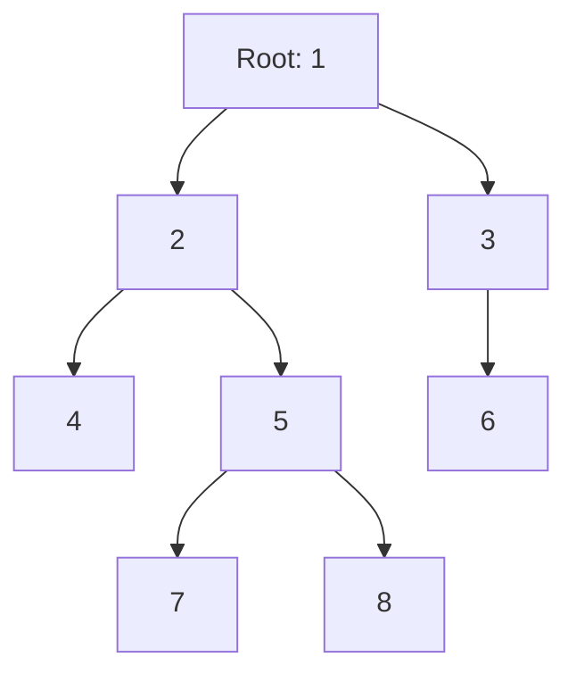
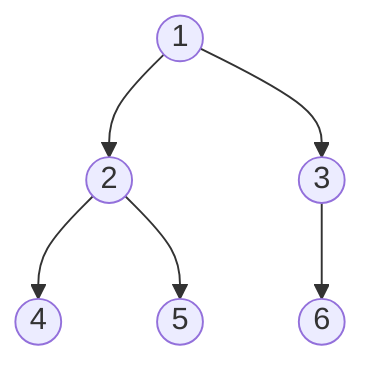

# 01 · 트리(Tree)의 기초와 순회

> **선수 학습**: Week 3 — Relations, Week 5(=3W.pdf) — Graph Theory
> 트리는 **"가장 단순한 연결 그래프"**입니다. 그래프의 일반 정의에서 *사이클*만 빼면 곧장 트리가 됩니다.

---

## 1.1 왜 트리인가?

컴퓨터 과학에서 트리를 빼면 다음이 다 무너집니다:

- **파일 시스템** — 디렉토리는 트리
- **DOM / HTML / JSON** — 모든 마크업은 트리
- **컴파일러의 파스 트리(AST)** — 코드의 문법 구조 = 트리
- **데이터베이스 인덱스** — B-tree, B+-tree
- **OS 프로세스** — 부모/자식 관계
- **검색 트리, 힙, 트라이** — 모든 기본 자료구조
- **Git의 커밋 히스토리** — DAG지만 본질은 트리
- **결정 트리, 게임 트리, 미니맥스** — 인공지능의 기반

> 그래프가 "쌍-관계의 통합 언어"였다면, **트리는 "계층(hierarchy)의 통합 언어"**입니다.

---

## 1.2 정의 (Definition)

### 정의 1.1 (Tree)
무향 그래프 $G = (V, E)$가 **트리**이려면:
1. **연결(connected)** — 모든 두 정점 사이에 경로가 존재
2. **사이클이 없음(acyclic)**

이 두 조건은 다음과 모두 동치입니다 (한 가지만 검증해도 트리임을 확신할 수 있음):

| 동치 정의 | 의미 |
|:--|:--|
| (a) 연결 + 사이클 없음 | 위 원래 정의 |
| (b) 두 정점 사이에 **유일한 경로** 존재 | path uniqueness |
| (c) 연결이면서 $\|E\| = \|V\| - 1$ | "딱 맞는 간선 수" |
| (d) 사이클 없으면서 $\|E\| = \|V\| - 1$ | "최대치까지 채운 숲" |
| (e) **minimally connected** | 어떤 간선이든 제거하면 분리됨 |
| (f) **maximally acyclic** | 어떤 간선이든 추가하면 사이클 생김 |

### 핵심 공식

$$
\boxed{\;|E| = |V| - 1\;}
$$

정점이 $n$개인 트리는 정확히 $n-1$개의 간선을 갖습니다. 이건 거의 모든 트리 문제의 시작점입니다.

---

## 1.3 트리 용어 사전

루트(root)를 지정하면 **rooted tree**가 됩니다. 이때 다음 용어가 정의됩니다:



| 용어 | 정의 | 위 그림에서 |
|:--|:--|:--|
| **Root** | 부모가 없는 최상단 노드 | `1` |
| **Parent / Child** | 직접 연결된 위·아래 노드 | `2`는 `4,5`의 부모 |
| **Sibling** | 같은 부모를 가진 노드들 | `4,5`는 형제 |
| **Ancestor** | 위쪽으로 거슬러 가는 모든 노드 | `4`의 ancestor: `2, 1` |
| **Descendant** | 아래로 내려가는 모든 노드 | `2`의 descendant: `4,5,7,8` |
| **Leaf (외부 노드)** | 자식이 없는 노드 | `4, 6, 7, 8` |
| **Internal (내부 노드)** | 자식이 ≥1개 | `1, 2, 3, 5` |
| **Depth(v)** | root에서 v까지의 거리 | depth(7)=3 |
| **Height(v)** | v에서 가장 깊은 leaf까지의 거리 | height(1)=3 |
| **Subtree** | 노드 v와 그 모든 descendant | `2`의 subtree = `{2,4,5,7,8}` |

### 정의 1.2 (m-ary tree)
모든 노드의 자식 수가 $\le m$인 rooted tree. 특히 $m=2$이면 **binary tree(이진 트리)**.

### 정의 1.3 (특수 이진 트리)
- **Full binary tree**: 모든 노드의 자식 수가 0 또는 2 (절반만 있는 게 없음)
- **Complete binary tree**: 마지막 레벨을 제외하면 꽉 차고, 마지막 레벨은 왼쪽부터 채워짐 → **힙(heap)의 구조**
- **Perfect binary tree**: 모든 leaf가 같은 depth에 있음 → 정확히 $2^{h+1}-1$개 노드
- **Balanced binary tree**: 모든 노드에서 왼쪽/오른쪽 subtree의 높이 차 $\le 1$ → AVL, Red-Black

---

## 1.4 트리에 관한 기본 정리

### 정리 1.1 (간선 수)
$n$개의 정점을 가진 트리는 정확히 $n-1$개의 간선을 갖는다.

<details>
<summary>증명 보기</summary>

**귀납법(induction)으로 증명.**

- **Base** ($n=1$): 정점 1개, 간선 0개. $|E| = 0 = 1-1$. ✓
- **Step**: $n$개 정점에 대해 성립한다고 가정. $n+1$개 정점 트리 $T$를 생각하자. 트리는 사이클이 없으므로 leaf가 존재한다(귀납적으로 증명 가능). leaf $v$와 그에 연결된 간선 $e$를 제거하면 정점 $n$개, 간선 $\|E\|-1$개의 트리가 된다. 귀납가정에서 $\|E\|-1 = n-1$, 즉 $\|E\| = n$. ✓

따라서 모든 트리에 대해 $\|E\| = \|V\| - 1$. $\blacksquare$
</details>

### 정리 1.2 (Perfect binary tree의 leaf 수)
높이 $h$인 perfect binary tree의 leaf 수는 정확히 $2^h$개, 총 노드 수는 $2^{h+1}-1$개.

<details>
<summary>증명 보기</summary>

각 레벨 $i$ ($0 \le i \le h$)에는 $2^i$개의 노드. 합하면:
$$
\sum_{i=0}^{h} 2^i = 2^{h+1}-1
$$

leaf는 마지막 레벨이므로 $2^h$개. $\blacksquare$
</details>

### 따름 정리 (Binary tree의 높이 하한)
노드 $n$개인 이진 트리의 높이는 $h \ge \lceil \log_2(n+1) \rceil - 1$.

> **CS 의의**: 균형 이진 탐색 트리(BST)에서 검색·삽입·삭제가 모두 $O(\log n)$인 이유.

---

## 1.5 트리의 표현 (Representation)

### (a) 인접 리스트 (Week 5 복습)
```python
# 무방향 트리, 정점 0..n-1
adj = [[] for _ in range(n)]
adj[u].append(v)
adj[v].append(u)
```

### (b) 부모 배열 (rooted tree)
```python
parent = [-1] * n  # parent[root] = -1
```

### (c) 좌·우 자식 포인터 (binary tree)
```python
class TreeNode:
    def __init__(self, val=0, left=None, right=None):
        self.val = val
        self.left = left
        self.right = right
```

### (d) 배열 표현 (complete binary tree → heap)
```python
# 1-based indexing 기준
# parent(i) = i // 2
# left(i)   = 2*i
# right(i)  = 2*i + 1
heap = [None, 50, 30, 40, 10, 20, 35]  # 인덱스 0은 미사용
```

---

## 1.6 트리 순회 (Tree Traversal)

이진 트리를 기준으로 4가지 표준 순회 방식이 있습니다. 핵심은 **현재 노드(N)를 언제 처리하는가**입니다.

### 1.6.1 깊이 우선 (DFS) — 3가지

| 순회 | 순서 | 활용 |
|:--|:--|:--|
| **Preorder** | N → L → R | 트리 복제, 디렉토리 출력 |
| **Inorder** | L → N → R | BST에서 정렬 순서 |
| **Postorder** | L → R → N | 트리 해제, 후위 표기식 계산 |



위 트리의 각 순회 결과:

- **Preorder**: `1, 2, 4, 5, 3, 6`
- **Inorder**: `4, 2, 5, 1, 6, 3`
- **Postorder**: `4, 5, 2, 6, 3, 1`

### 1.6.2 코드 (재귀)

```python
def preorder(root):
    if not root: return
    print(root.val)          # ① 자기 자신
    preorder(root.left)      # ② 왼쪽
    preorder(root.right)     # ③ 오른쪽

def inorder(root):
    if not root: return
    inorder(root.left)
    print(root.val)
    inorder(root.right)

def postorder(root):
    if not root: return
    postorder(root.left)
    postorder(root.right)
    print(root.val)
```

### 1.6.3 코드 (반복 — 스택 사용)

재귀가 깊어지면 stack overflow 위험. 명시적 스택으로 안전하게:

```python
def preorder_iter(root):
    if not root: return []
    stack, out = [root], []
    while stack:
        node = stack.pop()
        out.append(node.val)
        # 오른쪽을 먼저 push해야 왼쪽이 먼저 pop됨
        if node.right: stack.append(node.right)
        if node.left:  stack.append(node.left)
    return out
```

### 1.6.4 너비 우선 (BFS — level-order)

```python
from collections import deque

def level_order(root):
    if not root: return []
    q, out = deque([root]), []
    while q:
        node = q.popleft()
        out.append(node.val)
        if node.left:  q.append(node.left)
        if node.right: q.append(node.right)
    return out
```

위 트리의 BFS 결과: `1, 2, 3, 4, 5, 6`

---

## 1.7 잠깐, **왜** Inorder가 BST의 정렬 순서일까?

이진 탐색 트리(BST)의 정의는 다음과 같습니다 (자세한 건 [02-bst-and-heap.md](./02-bst-and-heap.md)):
> 모든 노드 $v$에 대해, **왼쪽 subtree의 모든 값 < $v$ < 오른쪽 subtree의 모든 값**

Inorder는 `L → N → R` 순서로 방문하므로,
- 왼쪽 모든 값(작은 것들) 먼저
- 자기 자신
- 오른쪽 모든 값(큰 것들) 마지막

→ 자연스럽게 **오름차순 정렬**이 나옵니다.

이게 BST가 정렬된 데이터 구조로 쓰이는 이유입니다.

---

## 1.8 사고 정리 — Week 1·2·3과의 연결

| Week | 개념 | Week 6의 일반화 |
|:--|:--|:--|
| 1 (Logic) | $p \to q$ | 부모 → 자식 관계 |
| 2 (Sets) | $\mathcal{P}(A)$ | 모든 subtree의 집합 |
| 3 (Relations) | Partial order, Hasse diagram | DAG의 한 형태 |
| 5 (Graphs) | Connected, acyclic | 트리 = 둘 다 |

---

## 1.9 빠른 자기 점검

1. 정점 100개짜리 트리의 간선 수는?  
   <details><summary>답</summary>99개. 트리는 항상 $|E| = |V|-1$.</details>

2. Preorder가 `[3,1,2,5,4]`인 이진 트리는 유일한가?  
   <details><summary>답</summary>아니요. Preorder 하나만으로는 트리를 복원할 수 없습니다. 보통 **Preorder + Inorder** 또는 **Postorder + Inorder**의 쌍이 있어야 트리가 유일하게 결정됩니다.</details>

3. Full binary tree와 Complete binary tree는 같은가?  
   <details><summary>답</summary>다릅니다. Full은 "자식이 0 또는 2", Complete는 "왼쪽부터 빈틈없이 채워짐". 둘 다 만족하는 게 perfect binary tree.</details>

---

 다음: [02-bst-and-heap.md](./02-bst-and-heap.md) — BST, Heap, Trie로 들어갑니다.
