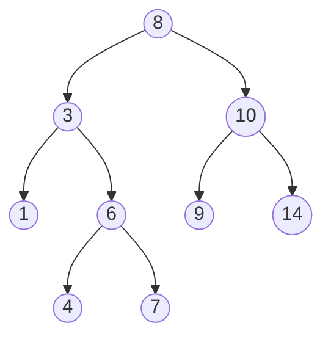
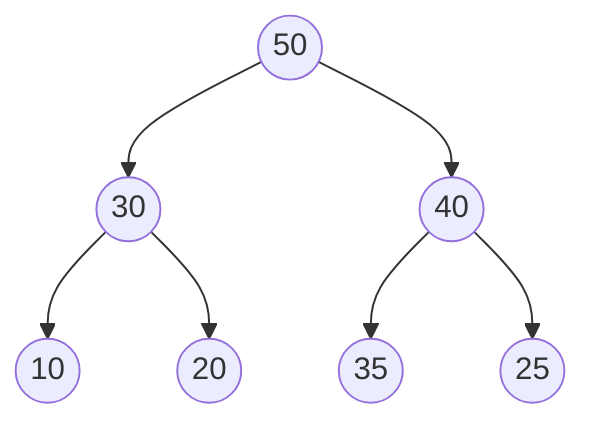
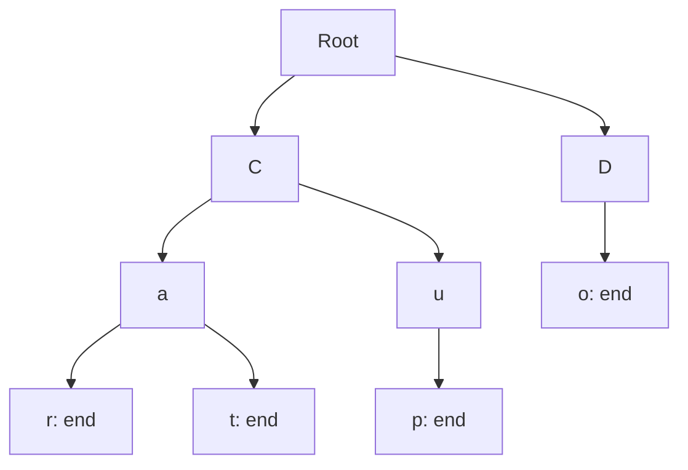

# 02 · BST · Heap · Trie

> 이진 트리는 단순한 구조지만, **순서·정렬·우선순위**를 어떻게 트리에 새기느냐에 따라 완전히 다른 자료구조가 됩니다.

---

## 2.1 이진 탐색 트리 (Binary Search Tree, BST)

### 정의 2.1 (BST)
이진 트리 $T$가 **BST**이려면, 모든 노드 $v$에 대해:
$$
\forall x \in L(v),\; x < v \quad \land \quad \forall y \in R(v),\; y > v
$$
($L(v), R(v)$는 각각 왼쪽·오른쪽 subtree의 원소들)

### 시각화



확인:
- `3`의 왼쪽: `{1}` 모두 3보다 작음
- `3`의 오른쪽: `{6, 4, 7}` 모두 3보다 큼
- `8`의 왼쪽: `{3,1,6,4,7}` 모두 8 미만
- `8`의 오른쪽: `{10,9,14}` 모두 8 초과

### 2.1.1 핵심 연산 — 모두 $O(h)$, 균형이면 $O(\log n)$

```cpp
struct TreeNode {
    int val;
    TreeNode* left;
    TreeNode* right;
    TreeNode(int v) : val(v), left(nullptr), right(nullptr) {}
};

// 검색
TreeNode* search(TreeNode* root, int key) {
    if (!root || root->val == key) return root;
    if (key < root->val) return search(root->left, key);
    return search(root->right, key);
}

// 삽입
TreeNode* insert(TreeNode* root, int key) {
    if (!root) return new TreeNode(key);
    if (key < root->val)      root->left  = insert(root->left, key);
    else if (key > root->val) root->right = insert(root->right, key);
    return root;
}
```

### 2.1.2 삭제 — 가장 까다로운 부분

삭제할 노드 $v$의 세 경우:
1. **leaf** — 그냥 제거
2. **자식 1개** — 자식으로 대체
3. **자식 2개** — 오른쪽 subtree의 **최솟값**(in-order successor) 또는 왼쪽 subtree의 **최댓값**으로 대체

```cpp
TreeNode* find_min(TreeNode* node) {
    while (node->left) node = node->left;
    return node;
}

TreeNode* erase(TreeNode* root, int key) {
    if (!root) return nullptr;
    if (key < root->val) {
        root->left = erase(root->left, key);
    } else if (key > root->val) {
        root->right = erase(root->right, key);
    } else {
        // 찾았다
        if (!root->left)  { TreeNode* r = root->right; delete root; return r; }
        if (!root->right) { TreeNode* l = root->left;  delete root; return l; }
        // 자식 2개: in-order successor로 대체
        TreeNode* succ = find_min(root->right);
        root->val = succ->val;
        root->right = erase(root->right, succ->val);
    }
    return root;
}
```

### 2.1.3 BST의 한계 — 그리고 자가 균형 트리

BST에 정렬된 순서로 삽입하면 → 한쪽으로 치우친 사슬(skewed) → $h = n-1$ → 검색이 $O(n)$.

해결: **AVL 트리**, **Red-Black 트리** (자가 균형 BST)
- 삽입·삭제 시 회전(rotation)으로 균형 유지
- 모든 연산 $O(\log n)$ 보장
- C++ `std::map`, `std::set`은 Red-Black 트리 기반

> 자가 균형 트리 구현은 알고리즘 수업의 영역이라 이번 강의에서는 *존재한다*는 사실만 짚고 갑니다.

---

## 2.2 힙 (Heap) — 우선순위 큐의 뼈대

### 정의 2.2 (Max-Heap)
**Complete binary tree**이면서, 모든 노드 $v$에 대해:
$$
v \ge \text{모든 } v\text{의 자식}
$$

Min-Heap은 부등호를 뒤집은 것.

### 핵심 차이 — BST vs Heap

| | BST | Heap |
|:--|:--|:--|
| 정렬성 | 좌 < 자기 < 우 | 부모와 자식 사이만 |
| 모양 | 임의 형태 | Complete binary tree |
| 최솟값 찾기 | $O(\log n)$ (왼쪽으로 끝까지) | $O(1)$ (루트) |
| 임의 원소 검색 | $O(\log n)$ | $O(n)$ |
| 활용 | 정렬 데이터 셋 | 우선순위 큐, 다익스트라 |

### 2.2.1 배열로 표현 (1-indexed)

```
인덱스:  1  2  3  4  5  6  7
값:     50 30 40 10 20 35 25
```



- `parent(i) = i / 2`
- `left(i) = 2*i`
- `right(i) = 2*i + 1`

### 2.2.2 핵심 연산 — Heapify Up / Down

```cpp
struct MinHeap {
    std::vector<int> h{0};  // 인덱스 0은 sentinel

    void push(int x) {
        h.push_back(x);
        sift_up((int)h.size() - 1);
    }

    int pop() {
        if (h.size() <= 1) return -1;
        int top = h[1];
        h[1] = h.back();
        h.pop_back();
        if (h.size() > 1) sift_down(1);
        return top;
    }

private:
    void sift_up(int i) {
        while (i > 1 && h[i] < h[i / 2]) {
            std::swap(h[i], h[i / 2]);
            i /= 2;
        }
    }

    void sift_down(int i) {
        int n = (int)h.size();
        while (2 * i < n) {
            int j = 2 * i;
            if (j + 1 < n && h[j + 1] < h[j]) ++j;
            if (h[i] <= h[j]) break;
            std::swap(h[i], h[j]);
            i = j;
        }
    }
};
```

C++은 `<queue>`의 `std::priority_queue`로 max-heap이 표준 라이브러리에 있습니다. min-heap은 비교자를 뒤집어서 사용:

```cpp
#include <queue>
std::priority_queue<int> max_heap;
std::priority_queue<int, std::vector<int>, std::greater<int>> min_heap;

min_heap.push(3);
min_heap.push(1);
min_heap.push(4);
std::cout << min_heap.top();  // 1
```

### 2.2.3 시간 복잡도

| 연산 | 복잡도 |
|:--|:--:|
| push | $O(\log n)$ |
| pop | $O(\log n)$ |
| peek (top) | $O(1)$ |
| build heap (배열 → 힙) | $O(n)$ |

> $O(n)$ build heap이 흥미로운 결과입니다. 각 노드에서 $O(\log n)$이 아니라, **bottom-up으로 sift-down하면 전체가 $O(n)$** 으로 줄어듭니다. 이는 트리의 높이별 노드 수가 기하급수적으로 감소하기 때문 ($\sum h \cdot 2^{-h}$가 수렴).

---

## 2.3 Trie (트라이) — 문자열 트리

### 정의 2.3 (Trie)
**간선에 문자**를 붙인 트리. 루트에서 어떤 노드까지의 경로 = 그 노드까지의 문자열 prefix.

### 시각화 — `{"car", "cat", "cup", "do"}`를 저장



`end` 표시는 "여기서 한 단어가 끝남"을 의미.

### 2.3.1 구현

```cpp
struct TrieNode {
    std::array<TrieNode*, 26> children{};   // 알파벳 26 (소문자 기준)
    bool is_end = false;
};

struct Trie {
    TrieNode* root = new TrieNode();

    void insert(const std::string& word) {
        TrieNode* node = root;
        for (char ch : word) {
            int idx = ch - 'a';
            if (!node->children[idx]) node->children[idx] = new TrieNode();
            node = node->children[idx];
        }
        node->is_end = true;
    }

    bool search(const std::string& word) const {
        TrieNode* node = walk(word);
        return node && node->is_end;
    }

    bool starts_with(const std::string& prefix) const {
        return walk(prefix) != nullptr;
    }

private:
    TrieNode* walk(const std::string& s) const {
        TrieNode* node = root;
        for (char ch : s) {
            int idx = ch - 'a';
            if (!node->children[idx]) return nullptr;
            node = node->children[idx];
        }
        return node;
    }
};
```

알파벳이 작거나 가변일 때는 배열 대신 `std::unordered_map<char, TrieNode*>`를 사용합니다.

### 2.3.2 활용

- **자동완성 (autocomplete)** — 검색창의 추천
- **사전 검색** — $O(L)$에 검색
- **IP 라우팅** — Patricia trie
- **bioinformatics** — suffix tree, suffix array
- **압축** — Lempel-Ziv

### 2.3.3 시간/공간

- 검색: $O(L)$ ($L$ = 검색어 길이) — 단어 개수 $n$과 무관
- 공간: 최악 $O(\sum L_i \cdot \lvert \Sigma \rvert)$ — 알파벳이 크면 비싸짐

---

## 2.4 BST · Heap · Trie 비교 정리

| 자료구조 | 키 정렬 | 최솟값 | 검색 | 주 용도 |
|:--|:--:|:--:|:--:|:--|
| **BST** (균형) | Yes | $O(\log n)$ | $O(\log n)$ | 정렬된 셋·맵 |
| **Heap** | No (부분만) | $O(1)$ | $O(n)$ | 우선순위 큐 |
| **Trie** | Yes (사전순) | $O(L)$ | $O(L)$ | 문자열·prefix |
| **Hash Table** (참고) | No | $O(n)$ | $O(1)$ 평균 | 키-값 매핑 |

> "세 구조 모두 트리"라는 점이 이 강의의 포인트입니다. 같은 골격에 다른 규칙을 얹은 것뿐입니다.

---

## 2.5 실습 예제 — LeetCode

### [LeetCode 700. Search in a Binary Search Tree](https://leetcode.com/problems/search-in-a-binary-search-tree/)

> 주어진 BST에서 값 `val`을 가진 노드를 찾으세요.

<details>
<summary>풀이 보기</summary>

```cpp
class Solution {
public:
    TreeNode* searchBST(TreeNode* root, int val) {
        while (root && root->val != val) {
            root = (val < root->val) ? root->left : root->right;
        }
        return root;
    }
};
```

BST 정의에 따라 한 방향씩만 내려가면 됩니다. 시간 $O(h)$, 공간 $O(1)$.
</details>

### [LeetCode 98. Validate Binary Search Tree](https://leetcode.com/problems/validate-binary-search-tree/)

> 주어진 이진 트리가 BST 조건을 만족하는지 검사하세요.

<details>
<summary>풀이 보기</summary>

**흔한 오답**: "각 노드에서 왼쪽 자식 < 자기 < 오른쪽 자식"만 보는 것. 이건 *지역적*인 조건만 검사하므로 틀립니다. 예:

```
    5
   / \
  3   7
     / \
    2   8     (2가 5보다 작은데 5의 오른쪽 subtree)
```

올바른 풀이: 각 노드에 **(min, max) 구간 제약**을 전달.

```cpp
class Solution {
public:
    bool isValidBST(TreeNode* root, long lo = LONG_MIN, long hi = LONG_MAX) {
        if (!root) return true;
        if (root->val <= lo || root->val >= hi) return false;
        return isValidBST(root->left,  lo, root->val)
            && isValidBST(root->right, root->val, hi);
    }
};
```

또는 in-order 순회 결과가 strictly increasing인지 검사해도 됩니다 (1.7절 참고).
</details>

### [LeetCode 215. Kth Largest Element in an Array](https://leetcode.com/problems/kth-largest-element-in-an-array/)

> 배열에서 k번째로 큰 원소를 찾으세요.

<details>
<summary>풀이 보기 (힙 사용)</summary>

```cpp
class Solution {
public:
    int findKthLargest(std::vector<int>& nums, int k) {
        // 크기 k인 min-heap을 유지. 결국 heap에는 상위 k개가 남고 top이 k번째 큰 값
        std::priority_queue<int, std::vector<int>, std::greater<int>> h;
        for (int x : nums) {
            h.push(x);
            if ((int)h.size() > k) h.pop();
        }
        return h.top();
    }
};
```

시간 $O(n \log k)$, 공간 $O(k)$. 전체 정렬 $O(n \log n)$보다 빠릅니다 (k가 작을수록).
</details>

### [LeetCode 208. Implement Trie (Prefix Tree)](https://leetcode.com/problems/implement-trie-prefix-tree/)

> Trie 자료구조의 `insert`, `search`, `startsWith` 메서드를 구현하세요.

<details>
<summary>풀이 보기</summary>

위 2.3.1의 코드를 그대로 LeetCode에 제출하면 통과합니다. 핵심은 알파벳 크기에 맞춰 자식 배열 또는 해시맵을 선택하는 것 — 알파벳 26개라면 배열이 효율적입니다.
</details>

### [LeetCode 295. Find Median from Data Stream](https://leetcode.com/problems/find-median-from-data-stream/)

> 스트림으로 들어오는 숫자들의 중앙값을 매번 빠르게 구하세요.

<details>
<summary>풀이 보기 (두 개의 힙)</summary>

**아이디어**: 작은 절반을 max-heap에, 큰 절반을 min-heap에 저장. 두 힙의 크기 차이를 1 이내로 유지.

```cpp
class MedianFinder {
    std::priority_queue<int> lo;  // max-heap (작은 절반)
    std::priority_queue<int, std::vector<int>, std::greater<int>> hi;  // min-heap

public:
    void addNum(int num) {
        lo.push(num);
        hi.push(lo.top()); lo.pop();  // lo의 max를 hi로
        if (hi.size() > lo.size()) {
            lo.push(hi.top()); hi.pop();
        }
    }

    double findMedian() {
        if (lo.size() > hi.size()) return lo.top();
        return (lo.top() + hi.top()) / 2.0;
    }
};
```

시간: addNum $O(\log n)$, findMedian $O(1)$.
</details>

---

다음: [03-spanning-tree-mst.md](./03-spanning-tree-mst.md) — 그래프에서 트리를 *뽑아내는* 두 가지 고전 알고리즘.
