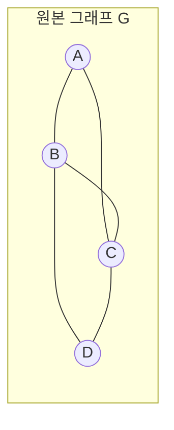
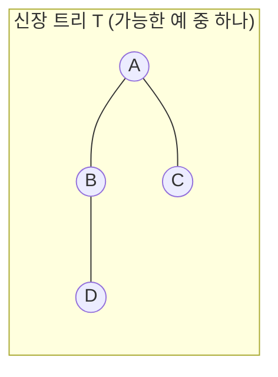

# 03 · 신장 트리(Spanning Tree)와 최소 신장 트리(MST)

> 그래프에서 *트리를 뽑아내는* 작업. 네트워크 설계, 클러스터링, 회로 라우팅의 핵심.

---

## 3.1 신장 트리 (Spanning Tree)

### 정의 3.1 (Spanning Tree)
연결 그래프 $G = (V, E)$의 **신장 트리** $T = (V, E')$는:
- $T$는 $G$의 부분 그래프 ($E' \subseteq E$)
- $T$는 **트리**
- $T$가 **$V$의 모든 정점**을 포함

즉, 그래프에서 사이클을 만드는 간선들을 적절히 제거해서 **트리로 만들되, 정점은 하나도 빼먹지 않는 것**.

### 예시





원본은 5개의 간선, 신장 트리는 $|V|-1 = 3$개의 간선만.

### 정리 3.1
- 연결 그래프에는 항상 신장 트리가 적어도 하나 존재.
- 신장 트리는 보통 **여러 개** 존재 (간선이 사이클을 이루는 만큼 선택지가 많음).

### 응용 — 트리는 왜 좋은가?
- **최소 간선** ($|V|-1$)으로 모든 정점을 연결 → 비용 절감
- **사이클 없음** → 라우팅 무한 루프 방지
- **유일한 경로** → 라우팅 결정이 deterministic

---

## 3.2 최소 신장 트리 (Minimum Spanning Tree, MST)

### 정의 3.2 (MST)
가중 무향 연결 그래프 $G = (V, E, w)$에서, 모든 신장 트리 중 **간선 가중치의 합이 최소**인 것:
$$
T^* = \arg\min_{T \text{ spanning tree}} \sum_{e \in T} w(e)
$$

### 실생활 예시

- **통신망 구축**: 도시 간 광케이블을 깔 때, 모든 도시를 연결하되 총 케이블 길이 최소화
- **회로 배선**: 칩 위의 핀들을 최소 길이 와이어로 연결
- **클러스터링**: 데이터 포인트 간 유사도를 가중치로, MST를 만든 후 가장 무거운 간선을 잘라서 클러스터 분리

---

## 3.3 MST의 핵심 성질 — Cut Property

### 정리 3.2 (Cut Property)
$S \subset V$가 정점들의 부분집합이라 하고, **cut** = $S$와 $V \setminus S$ 사이의 간선들의 집합이라 하자. 만약 어떤 간선 $e^*$가 이 cut의 간선들 중 **가중치가 가장 작다**면, $e^*$는 어떤 MST에 반드시 포함된다.

<details>
<summary>증명 (교환 논증)</summary>

MST $T$가 $e^* = (u,v)$를 포함하지 않는다고 가정. $T \cup \{e^*\}$는 사이클 $C$를 포함 (트리에 간선 추가 → 정확히 한 사이클). $C$는 $S$와 $V \setminus S$를 가르는 cut을 짝수 번 건넌다 → cut을 건너는 또 다른 간선 $e' \in C$가 있다.

$w(e^*) \le w(e')$이므로, $T' = T \cup \{e^*\} \setminus \{e'\}$도 신장 트리이고 가중치는 $T$ 이하. $T$가 MST이므로 $T'$도 MST. ✓ $\blacksquare$
</details>

이 성질이 두 고전 알고리즘 **Kruskal**과 **Prim**의 정당성의 핵심입니다.

---

## 3.4 Kruskal 알고리즘 — "가장 싼 간선부터"

### 아이디어
1. 모든 간선을 가중치 오름차순으로 정렬
2. 가장 싼 간선부터 보면서, **사이클을 만들지 않으면** MST에 추가
3. $|V|-1$개를 모았으면 종료

### Union-Find가 필요한 이유

"사이클을 만들지 않는지" 확인 = "이 간선의 두 끝점이 이미 같은 component에 속하는지" 확인 → **Union-Find(Disjoint Set Union)**가 정확히 이걸 합니다.

### 의사 코드

```
sort edges by weight ascending
DSU.init(V)
T = []
for (u,v,w) in sorted edges:
    if DSU.find(u) != DSU.find(v):
        DSU.union(u, v)
        T.append((u,v,w))
        if |T| == |V|-1: break
return T
```

### 파이썬 구현

```python
class DSU:
    def __init__(self, n):
        self.parent = list(range(n))
        self.rank = [0] * n

    def find(self, x):
        while self.parent[x] != x:
            self.parent[x] = self.parent[self.parent[x]]  # path compression
            x = self.parent[x]
        return x

    def union(self, x, y):
        rx, ry = self.find(x), self.find(y)
        if rx == ry: return False
        # union by rank
        if self.rank[rx] < self.rank[ry]:
            rx, ry = ry, rx
        self.parent[ry] = rx
        if self.rank[rx] == self.rank[ry]:
            self.rank[rx] += 1
        return True

def kruskal(n, edges):
    """edges: list of (weight, u, v)"""
    edges.sort()
    dsu = DSU(n)
    mst = []
    total = 0
    for w, u, v in edges:
        if dsu.union(u, v):
            mst.append((u, v, w))
            total += w
            if len(mst) == n - 1:
                break
    return mst, total
```

### 복잡도
- 정렬: $O(|E| \log |E|)$
- Union-Find: 거의 $O(|E| \cdot \alpha(V))$ — $\alpha$는 inverse Ackermann (사실상 상수)
- **총: $O(|E| \log |E|)$**

### 동작 예시

다음 그래프:

```
A --1-- B
|       |
4       2
|       |
C --3-- D
```

가중치 정렬: `(1,A,B), (2,B,D), (3,C,D), (4,A,C)`

| Step | 간선 | 동작 |
|:--|:--|:--|
| 1 | (1,A,B) | A, B 다른 set → union, MST에 추가 |
| 2 | (2,B,D) | B, D 다른 set → union, MST에 추가 |
| 3 | (3,C,D) | C, D 다른 set → union, MST에 추가. |MST|=3=|V|-1, 종료 |
| ~~4~~ | ~~(4,A,C)~~ | (사이클 형성, 안 봄) |

총 가중치: $1 + 2 + 3 = 6$

---

## 3.5 Prim 알고리즘 — "한 정점에서 자라나는 트리"

### 아이디어
1. 시작 정점 하나를 트리에 포함
2. 매 단계, 현재 트리와 연결된 간선 중 **가장 싼 것**을 추가 (사이클 만들면 안 됨)
3. 모든 정점이 트리에 포함될 때까지 반복

이 과정에서 매번 "최소 가중치 간선"을 빠르게 꺼내야 하므로 **min-heap (우선순위 큐)**가 필요합니다.

### 의사 코드

```
start with any vertex s
visited = {s}
heap = [(w, s, v) for each edge (s,v,w)]
T = []
while heap and |T| < |V|-1:
    (w, u, v) = heappop(heap)
    if v in visited: continue
    visited.add(v)
    T.append((u,v,w))
    for each edge (v, x, w'):
        if x not in visited:
            heappush(heap, (w', v, x))
return T
```

### 파이썬 구현

```python
import heapq

def prim(n, adj, start=0):
    """adj: dict of {u: [(v, w), ...]}"""
    visited = [False] * n
    visited[start] = True
    heap = [(w, start, v) for v, w in adj[start]]
    heapq.heapify(heap)
    mst = []
    total = 0
    while heap and len(mst) < n - 1:
        w, u, v = heapq.heappop(heap)
        if visited[v]:
            continue
        visited[v] = True
        mst.append((u, v, w))
        total += w
        for x, ww in adj[v]:
            if not visited[x]:
                heapq.heappush(heap, (ww, v, x))
    return mst, total
```

### 복잡도
- 각 간선이 최대 1번 heap에 들어감 → $O(|E| \log |E|)$
- $|E| \le |V|^2$이므로 $O(|E| \log |V|)$로 자주 표기

### Fibonacci heap 사용 시
$O(|E| + |V| \log |V|)$ — 이론적으로 흥미롭지만 실전에서는 binary heap이 더 빠른 경우가 대부분.

---

## 3.6 Kruskal vs Prim 비교

| | Kruskal | Prim |
|:--|:--|:--|
| 관점 | 간선 중심 | 정점 중심 |
| 자료구조 | Union-Find | Min-heap |
| 정렬 필요 | Yes | No (heap이 대신) |
| 그래프 표현 | 간선 리스트 적합 | 인접 리스트 적합 |
| 희소 그래프(sparse) | ✓ 유리 | △ |
| 밀집 그래프(dense) | △ | ✓ 유리 |
| 병렬화 | 어려움 | 더 어려움 |

> **둘 다 시간 복잡도는 동일 클래스 ($O(E \log V)$)**, 어떤 자료구조가 친숙하냐로 고르세요.

---

## 3.7 변형 — Maximum Spanning Tree

가중치를 부호 바꾸거나, 내림차순 정렬해서 Kruskal을 그대로 돌리면 됩니다. **"통신 채널의 대역폭 최대화", "신뢰도 최대화"** 등에서 등장.

---

## 3.8 변형 — Bottleneck Spanning Tree

신장 트리 중 **가장 큰 간선의 가중치**가 최소가 되는 트리. 사실: **모든 MST는 Bottleneck Spanning Tree이기도 함**. (역은 거짓 — Bottleneck인 트리가 MST가 아닐 수 있음.)

---

## 3.9 실습 예제 — LeetCode

###  [LeetCode 1971. Find if Path Exists in Graph](https://leetcode.com/problems/find-if-path-exists-in-graph/)

> 무방향 그래프에서 두 정점 사이에 경로가 있는지 판별.

<details>
<summary>풀이 보기 (Union-Find 연습)</summary>

```python
class DSU:
    def __init__(self, n):
        self.p = list(range(n))
    def find(self, x):
        while self.p[x] != x:
            self.p[x] = self.p[self.p[x]]
            x = self.p[x]
        return x
    def union(self, x, y):
        self.p[self.find(x)] = self.find(y)

class Solution:
    def validPath(self, n, edges, source, destination):
        dsu = DSU(n)
        for u, v in edges:
            dsu.union(u, v)
        return dsu.find(source) == dsu.find(destination)
```

**해설**: MST 알고리즘 자체는 아니지만, Union-Find가 *연결성*을 판단하는 핵심 도구임을 익히는 문제. Kruskal의 핵심 building block입니다.
</details>

###  [LeetCode 1584. Min Cost to Connect All Points](https://leetcode.com/problems/min-cost-to-connect-all-points/)

> 2D 평면 위의 점들이 주어졌을 때, 모든 점을 연결하는 최소 비용은? (간선 비용은 맨해튼 거리)

<details>
<summary>풀이 보기 (Prim)</summary>

```python
import heapq
class Solution:
    def minCostConnectPoints(self, points):
        n = len(points)
        visited = [False] * n
        heap = [(0, 0)]  # (cost, point_idx) — 시작점에 cost 0으로 진입
        total = 0
        count = 0
        while heap and count < n:
            cost, u = heapq.heappop(heap)
            if visited[u]:
                continue
            visited[u] = True
            total += cost
            count += 1
            x1, y1 = points[u]
            for v in range(n):
                if not visited[v]:
                    x2, y2 = points[v]
                    d = abs(x1-x2) + abs(y1-y2)
                    heapq.heappush(heap, (d, v))
        return total
```

**해설**: 완전 그래프(모든 점 쌍이 간선)이므로 dense → Prim이 자연스러움. 간선을 미리 만들 필요 없이, 매 정점에서 다른 모든 정점으로의 거리를 계산.

**시간**: $O(n^2 \log n)$
</details>

###  [LeetCode 1135. Connecting Cities With Minimum Cost](https://leetcode.com/problems/connecting-cities-with-minimum-cost/) (Premium)

대안 무료 문제: [LeetCode 547. Number of Provinces](https://leetcode.com/problems/number-of-provinces/) — 연결 성분 세기 (Union-Find 연습)

<details>
<summary>547번 풀이 보기</summary>

```python
class Solution:
    def findCircleNum(self, isConnected):
        n = len(isConnected)
        parent = list(range(n))
        def find(x):
            while parent[x] != x:
                parent[x] = parent[parent[x]]
                x = parent[x]
            return x
        def union(x, y):
            parent[find(x)] = find(y)
        for i in range(n):
            for j in range(i+1, n):
                if isConnected[i][j]:
                    union(i, j)
        return len({find(i) for i in range(n)})
```

연결 성분의 개수 = Union-Find에서 root가 다른 개수.
</details>

###  [LeetCode 778. Swim in Rising Water](https://leetcode.com/problems/swim-in-rising-water/)

> 격자에서 좌상단에서 우하단으로 이동. 각 칸의 시간을 지나야만 통과. 최소 출발 시간은?

<details>
<summary>풀이 보기 (Bottleneck path = MST variant)</summary>

```python
import heapq
class Solution:
    def swimInWater(self, grid):
        n = len(grid)
        heap = [(grid[0][0], 0, 0)]
        seen = {(0, 0)}
        while heap:
            t, r, c = heapq.heappop(heap)
            if r == n-1 and c == n-1:
                return t
            for dr, dc in [(-1,0),(1,0),(0,-1),(0,1)]:
                nr, nc = r+dr, c+dc
                if 0 <= nr < n and 0 <= nc < n and (nr,nc) not in seen:
                    seen.add((nr, nc))
                    # 새 셀의 시간은 max(현재까지 최대, 새 셀 값)
                    heapq.heappush(heap, (max(t, grid[nr][nc]), nr, nc))
        return -1
```

**해설**: "경로 위의 최대 가중치를 최소화" = bottleneck path 문제. Dijkstra와 거의 같지만 `+` 대신 `max`를 사용. MST의 cut property가 이 구조의 이론적 기반.
</details>

---

 다음: [04-boolean-algebra.md](./04-boolean-algebra.md) — 부울 대수의 세계로.
