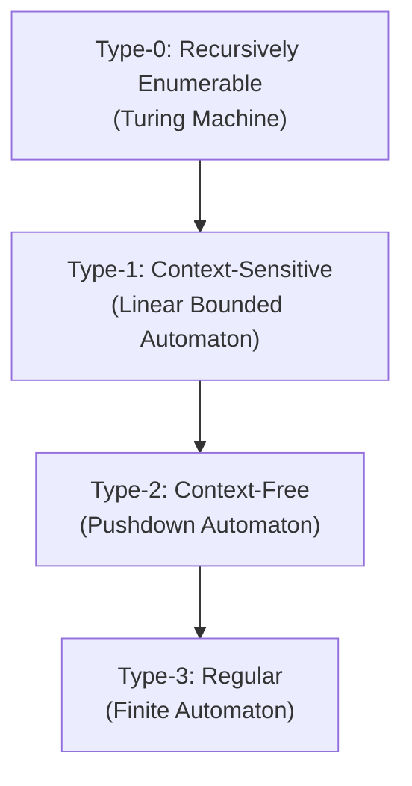
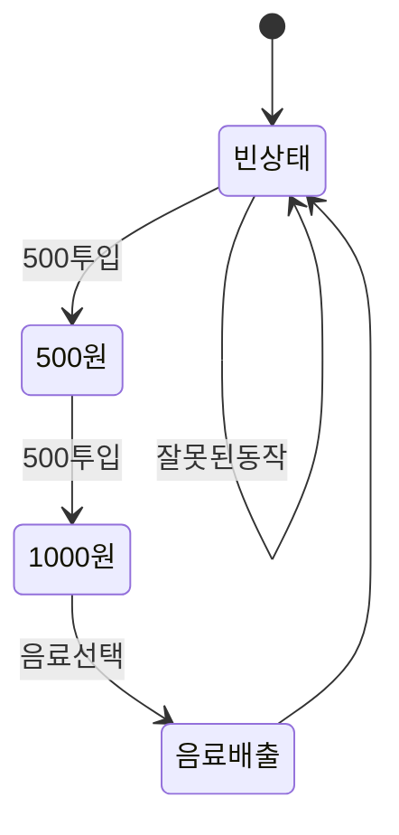

# 06 · 오토마타와 형식 언어 (Automata & Formal Languages)

> "*계산이란 무엇인가?*"라는 가장 근본적인 질문에 대답하기 위해 만든 **추상 기계**가 오토마타입니다. Turing 이전 시대부터 컴퓨터의 이론적 본질을 묻기 위한 도구였습니다.

---

## 6.1 왜 오토마타인가?

### 일상에 숨어있는 오토마타

- **자판기**: 동전 투입 → 상태 변화 → 음료 출력
- **신호등**: 빨강 → 노랑 → 초록 → ...
- **로그인 프로세스**: 미인증 → 인증중 → 인증완료 → 만료
- **TCP 통신**: SYN → SYN-ACK → ESTABLISHED → FIN ...
- **정규 표현식 매칭**: 우리가 매일 쓰는 grep/regex의 뒤에 오토마타가 있음
- **컴파일러의 lexer**: 소스 코드를 토큰으로 분해
- **HTTP 요청 파싱**: 헤더 줄 단위 처리
- **게임 AI**: 상태에 따라 행동 결정 (FSM, Behavior Tree)

> 모든 *상태가 있고 입력에 반응하는* 시스템은 오토마타 모델로 분석할 수 있습니다.

### 이론적 의의

오토마타는 **계산 능력의 계층(Chomsky hierarchy)**을 정의합니다:
- 가장 단순한 기계: **유한 오토마타(FA)** ← 이번 주의 주인공
- 그 위: **푸시다운 오토마타(PDA)** — 괄호 매칭 가능
- 가장 강력: **튜링 기계(TM)** — 알고리즘이라 부르는 모든 것

> "어떤 문제는 유한 오토마타로 풀 수 있고, 어떤 문제는 절대 못 푼다." 이걸 명확히 구분하는 게 오토마타 이론의 핵심 결과.

---

## 6.2 알파벳, 문자열, 언어

### 정의 6.1 (Alphabet, 알파벳)
**유한한** 기호들의 집합. 보통 $\Sigma$로 표기.

예:
- $\Sigma = \{0, 1\}$ (이진 알파벳)
- $\Sigma = \{a, b, c, \dots, z\}$
- $\Sigma = \{\text{int}, \text{return}, \text{if}, \text{id}, \dots\}$ (프로그래밍 언어 토큰)

### 정의 6.2 (String, 문자열)
$\Sigma$의 기호들의 **유한한** 나열.

- $\varepsilon$ (epsilon): **빈 문자열** (기호 0개) — 매우 중요한 특수 케이스
- $|w|$: 문자열 $w$의 길이 (기호 개수). $|\varepsilon|=0$.
- $w \cdot v$ 또는 $wv$: 두 문자열의 **연결(concatenation)**. `"abc" · "de" = "abcde"`
- $w^n$: $w$를 $n$번 연결. $w^0 = \varepsilon$, $w^3 = www$.
- $w^R$: $w$를 뒤집은 것. `"abc"^R = "cba"`.

### 정의 6.3 ($\Sigma^*$와 $\Sigma^+$)
- $\Sigma^*$: $\Sigma$ 위의 **모든** 문자열의 집합 ($\varepsilon$ 포함)
- $\Sigma^+$: $\varepsilon$을 제외한 모든 문자열의 집합

$\Sigma^* = \Sigma^+ \cup \{\varepsilon\}$.

$\Sigma = \{0,1\}$이라면:
$$
\Sigma^* = \{\varepsilon, 0, 1, 00, 01, 10, 11, 000, \dots\}
$$
$|\Sigma^*| = \aleph_0$ (가산 무한, Week 2 참고).

### 정의 6.4 (Language, 언어)
**언어 $L$ = $\Sigma^*$의 부분집합**.

$$
L \subseteq \Sigma^*
$$

언어란 그저 "어떤 문자열들의 모임"입니다. 예:
- $L_1 = \{0, 01, 011, 0111, \dots\} = \{0^n 1^n : n \ge 0\}$ — *이건 실은 regular가 아닙니다*
- $L_2 = \{w \in \{0,1\}^* : w \text{ ends with } 1\}$
- $L_3 = $ "올바른 Python 프로그램의 집합"
- $L_4 = \emptyset$ (빈 언어)
- $L_5 = \{\varepsilon\}$ (빈 문자열만 포함하는 언어 — $\emptyset$와 다름!)

> **언어 = 집합**. Week 2의 모든 집합 연산이 그대로 쓰입니다 ($\cup, \cap, \setminus$ 등).

---

## 6.3 언어 위의 연산

### 6.3.1 표준 집합 연산
- $L_1 \cup L_2$: 합집합
- $L_1 \cap L_2$: 교집합
- $L^c = \Sigma^* \setminus L$: 보집합

### 6.3.2 연결(Concatenation)
$$
L_1 \cdot L_2 = \{xy : x \in L_1,\; y \in L_2\}
$$
예: $L_1 = \{a, ab\}$, $L_2 = \{c, d\}$이면 $L_1 L_2 = \{ac, ad, abc, abd\}$.

### 6.3.3 거듭제곱
- $L^0 = \{\varepsilon\}$
- $L^n = L \cdot L^{n-1}$

### 6.3.4 Kleene Star — 오토마타 이론의 핵심 연산
$$
L^* = \bigcup_{n=0}^{\infty} L^n = L^0 \cup L^1 \cup L^2 \cup \dots
$$

**"$L$의 원소를 0번 이상 연결한 모든 문자열"**.

예: $L = \{a, b\}$이면 $L^* = \{\varepsilon, a, b, aa, ab, ba, bb, aaa, \dots\}$.

특히: **$\Sigma^* = \Sigma$의 Kleene star** (이게 표기의 유래).

### 6.3.5 Kleene Plus
$$
L^+ = \bigcup_{n=1}^{\infty} L^n = L \cdot L^*
$$
$L^*$와 같지만 $\varepsilon$이 빠짐 (단, $\varepsilon \in L$인 경우는 예외).

---

## 6.4 결정 문제(Decision Problem)와 언어

### 핵심 통찰

> **모든 "예/아니오 문제"는 언어 문제와 동치다.**

문제: "정수 $n$은 소수인가?"
↔ 언어: $L_{\text{prime}} = \{n \in \mathbb{N} : n \text{ is prime}\}$의 멤버십 판정.

문제: "문자열 $w$에 0이 짝수 개 있는가?"
↔ 언어: $L_{\text{even-0}} = \{w \in \{0,1\}^* : w$에 0이 짝수 개$\}$의 멤버십.

문제: "이 Python 코드는 syntactically 올바른가?"
↔ 언어: $L_{\text{Python}}$의 멤버십.

> 이게 오토마타 이론이 **모든** 계산 문제를 다룰 수 있는 이유.

---

## 6.5 언어의 분류 — Chomsky Hierarchy 미리보기

언어는 **어떤 종류의 기계가 그것을 인식할 수 있느냐**에 따라 계층이 있습니다.



| 타입 | 언어 클래스 | 인식 기계 | 예시 |
|:--:|:--|:--|:--|
| 3 | Regular | DFA / NFA | 짝수 개 0 가진 문자열 |
| 2 | Context-Free | PDA | 균형 잡힌 괄호 |
| 1 | Context-Sensitive | LBA | $\{a^n b^n c^n\}$ |
| 0 | Recursively Enumerable | TM | 정지 문제 등 |

이번 강의의 주 무대는 **Type-3, Regular Languages**입니다. 가장 단순하지만, 가장 자주 쓰임 (정규 표현식!).

[10-pumping-lemma-chomsky.md](./10-pumping-lemma-chomsky.md)에서 자세히.

---

## 6.6 유한 오토마타(Finite Automaton)의 직관

### 비유 — 자판기 상태도



핵심 요소:
- **상태(state)**: "지금 얼마 들어갔나"
- **입력(input)**: 동전 투입, 버튼 누름
- **전이(transition)**: 상태 간 화살표
- **시작 상태**
- **수용/종료 상태**

이걸 수학적으로 정의한 게 **DFA(결정적 유한 오토마타)**입니다.

---

## 6.7 잠깐, 왜 *유한*인가?

기계가 **유한한 메모리(상태)**만 가지고 무한한 길이의 문자열을 처리해야 한다는 제약.

이 제약이 만드는 결과:
- 인식 가능한 언어 = **Regular Languages** (가장 작은 클래스)
- 인식 **불가능**한 예시:
  - $\{0^n 1^n : n \ge 0\}$ — 0의 개수와 1의 개수가 같은 문자열들
  - 균형 잡힌 괄호 — 깊이를 세야 하는데 상태가 부족
  - 회문(palindrome)

> 이건 단순한 한계가 아니라, **무엇이 가능한지에 대한 정확한 수학적 답변**입니다. → 펌핑 보조정리(10번 파일).

---

## 6.8 핵심 정의 — 다음 파일로 가는 발판

### 정의 6.5 (Regular Language)
어떤 유한 오토마타로 인식할 수 있는 언어. 동치로, 정규 표현식으로 표현할 수 있는 언어.

이게 우리가 다음 4개 파일에서 다룰 전부입니다:

- [07. DFA](./07-dfa.md) — 결정적 유한 오토마타
- [08. NFA](./08-nfa-equivalence.md) — 비결정적, 그리고 DFA와 같은 표현력
- [09. Regex](./09-regex.md) — 정규 표현식, Kleene 정리
- [10. Pumping & Chomsky](./10-pumping-lemma-chomsky.md) — 무엇을 못 하는가? 그리고 그 위의 세계

---

## 6.9 빠른 자기 점검

1. $\Sigma = \{a,b\}$일 때 $|\Sigma^3|$은?  
   <details><summary>답</summary>$2^3 = 8$. 길이 3인 모든 문자열.</details>

2. $\emptyset^* = ?$  
   <details><summary>답</summary>$\{\varepsilon\}$. $\emptyset^0 = \{\varepsilon\}$가 들어가기 때문. **빈 언어와 다름!**</details>

3. 언어 $L = \{a, b\}$의 $L^2$를 모두 나열하라.  
   <details><summary>답</summary>$\{aa, ab, ba, bb\}$. 4개.</details>

4. "올바른 산술식의 집합"은 Regular한가?  
   <details><summary>답</summary>아닙니다. 괄호 깊이가 임의로 깊어질 수 있어 유한 상태로 추적 불가. **Context-free** 언어입니다.</details>

5. 모든 유한 언어는 Regular인가?  
   <details><summary>답</summary>예. 유한 개의 문자열이 있으면 그것들을 정확히 받는 DFA를 *만들 수 있음* (각 문자열마다 한 줄의 상태).</details>

---

## 6.10 Python으로 언어 다루기 — 워밍업

```python
def kleene_star(L, n):
    """L의 0..n번 연결 결과를 반환"""
    result = {""}  # L^0
    current = {""}
    for i in range(n):
        current = {x + y for x in current for y in L}
        result |= current
    return result

L = {"a", "ab"}
print(kleene_star(L, 3))
# {'', 'a', 'ab', 'aa', 'aab', 'aba', 'abab', 'aaa', 'aaab', ...}
```

```python
def concat(L1, L2):
    return {x + y for x in L1 for y in L2}

def intersect(L1, L2):
    return L1 & L2  # 집합 그대로

L1 = {"a", "ab"}
L2 = {"c", "d"}
print(concat(L1, L2))   # {'ac', 'ad', 'abc', 'abd'}
```

> 언어는 그저 *문자열의 집합*임을 기억하세요.

---

➡️ 다음: [07-dfa.md](./07-dfa.md) — 첫 번째 진짜 기계, DFA.
