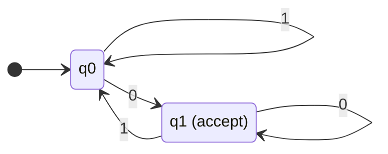
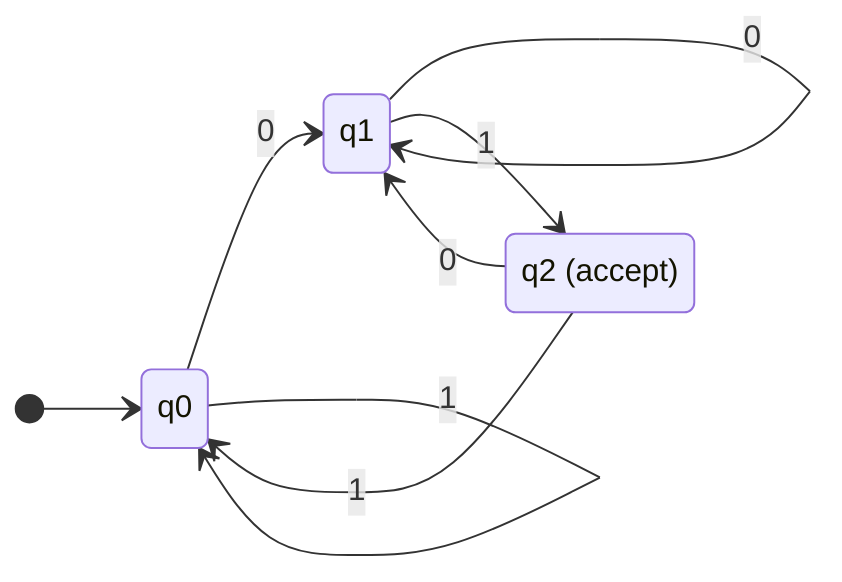
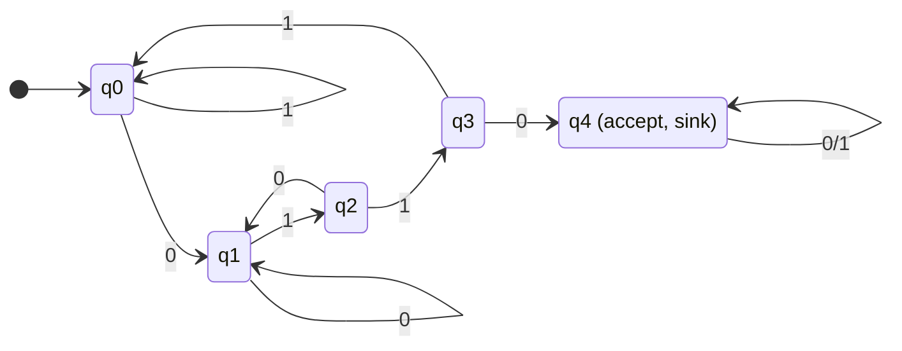
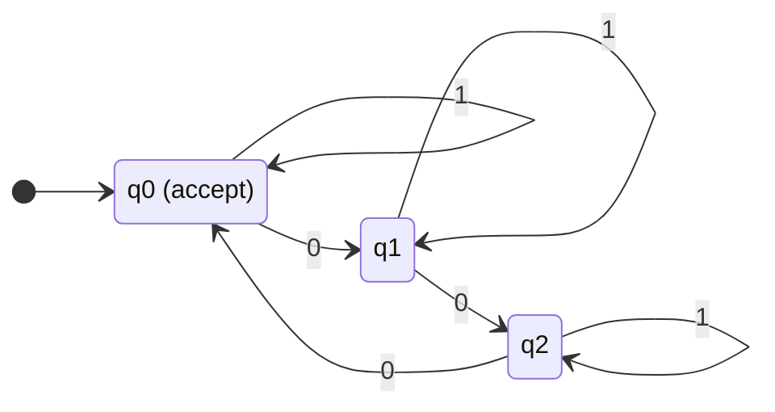

# 07 · 결정적 유한 오토마타 (DFA)

> 모든 오토마타 이론의 출발점. "가장 단순한 기계"가 가진 표현력을 정확히 묻는 것이 이번 챕터입니다.

---

## 7.1 DFA의 형식적 정의

### 정의 7.1 (Deterministic Finite Automaton)
DFA는 5-tuple $M = (Q, \Sigma, \delta, q_0, F)$:

| 기호 | 이름 | 의미 |
|:--:|:--|:--|
| $Q$ | 상태 집합 | 유한 |
| $\Sigma$ | 입력 알파벳 | 유한 |
| $\delta: Q \times \Sigma \to Q$ | **전이 함수** | (상태, 입력) → 다음 상태 |
| $q_0 \in Q$ | 시작 상태 | |
| $F \subseteq Q$ | 수용(accept) 상태 집합 | |

### "결정적"의 의미
모든 (상태, 입력) 쌍에 대해 **정확히 하나의 다음 상태**가 정의됩니다. 다른 선택지 없음, 비결정성 없음.

### 7.1.1 첫 번째 예시 — "0으로 끝나는 문자열"

$L = \{w \in \{0,1\}^* : w \text{ ends with } 0\}$



형식적으로:
- $Q = \{q_0, q_1\}$
- $\Sigma = \{0, 1\}$
- $\delta$: 표
  | | 0 | 1 |
  |:--:|:--:|:--:|
  | $q_0$ | $q_1$ | $q_0$ |
  | $q_1$ | $q_1$ | $q_0$ |
- 시작: $q_0$
- 수용: $F = \{q_1\}$

문자열 `1101`을 처리:
- $q_0 \xrightarrow{1} q_0 \xrightarrow{1} q_0 \xrightarrow{0} q_1 \xrightarrow{1} q_0$
- 끝 상태 $q_0 \notin F$ → 거부(reject)

문자열 `110`을 처리:
- $q_0 \xrightarrow{1} q_0 \xrightarrow{1} q_0 \xrightarrow{0} q_1$
- 끝 상태 $q_1 \in F$ → 수용(accept)

---

## 7.2 확장 전이 함수 $\hat\delta$

$\delta$는 한 글자 처리. 문자열 전체를 처리하려면 확장해야 합니다.

### 정의 7.2 ($\hat\delta$)
$$
\hat\delta: Q \times \Sigma^* \to Q
$$
재귀적으로:
- $\hat\delta(q, \varepsilon) = q$
- $\hat\delta(q, wa) = \delta(\hat\delta(q, w), a)$ for $a \in \Sigma$, $w \in \Sigma^*$

### 정의 7.3 (DFA가 인식하는 언어)
$$
L(M) = \{w \in \Sigma^* : \hat\delta(q_0, w) \in F\}
$$

DFA $M$이 인식하는 언어는 시작 상태에서 출발해 문자열을 따라간 끝 상태가 수용 상태인 문자열들의 집합입니다.

---

## 7.3 DFA를 설계하는 법 — 패턴

### 패턴 1: "$\dots$로 끝나는 문자열" / "$\dots$로 시작하는 문자열"

마지막 $k$개의 글자를 기억하면 됨 → 상태 수 $O(|\Sigma|^k)$.

#### 예 — "01로 끝나는 문자열"



상태 해석:
- $q_0$: 직전 글자가 1 또는 시작 (가능성 없음)
- $q_1$: 직전 글자가 0 (다음에 1 오면 수용)
- $q_2$: 마지막 2글자가 `01` (수용)

### 패턴 2: "$\dots$를 부분 문자열로 포함"

같은 아이디어 — "지금까지 본 패턴의 prefix 길이"를 상태로.

#### 예 — "0110을 포함"



이게 바로 KMP 알고리즘의 실패 함수의 기반입니다.

### 패턴 3: 모듈러 카운팅

"$\Sigma$의 한 글자가 등장한 횟수가 $k$의 배수" 같은 조건.

#### 예 — "0의 개수 mod 3 = 0"

상태: $q_0, q_1, q_2$ (각각 mod 3 = 0, 1, 2). 1이 들어오면 그대로, 0이 들어오면 다음 상태.



### 패턴 4: 두 조건의 AND/OR — 곱 구성(Product Construction)

언어 $L_1$은 DFA $M_1$이, $L_2$는 $M_2$가 인식. $L_1 \cap L_2$ 또는 $L_1 \cup L_2$를 인식하는 DFA는?

**답**: $M_1 \times M_2$의 곱 구성. 상태는 $(q_1, q_2)$ 쌍, 전이는 동시에.

- $L_1 \cap L_2$: 수용 상태는 $F_1 \times F_2$ — 둘 다 수용 상태인 쌍.
- $L_1 \cup L_2$: 수용 상태는 둘 중 하나라도 수용 상태인 쌍.

이 결과로 정규 언어가 $\cup, \cap, \setminus, ^c$에 대해 closed임을 증명할 수 있습니다.

---

## 7.4 C++로 DFA 구현

```cpp
#include <bits/stdc++.h>
using namespace std;

struct DFA {
    set<string> states;
    set<char> alphabet;
    map<pair<string,char>, string> delta;
    string start;
    set<string> accept;

    bool accepts(const string& w) const {
        string q = start;
        for (char ch : w) {
            if (!alphabet.count(ch)) return false;
            auto it = delta.find({q, ch});
            if (it == delta.end()) return false;
            q = it->second;
        }
        return accept.count(q) > 0;
    }
};

int main() {
    // "0으로 끝나는 문자열" DFA
    DFA m;
    m.states   = {"q0", "q1"};
    m.alphabet = {'0', '1'};
    m.delta    = {
        {{"q0", '0'}, "q1"}, {{"q0", '1'}, "q0"},
        {{"q1", '0'}, "q1"}, {{"q1", '1'}, "q0"},
    };
    m.start  = "q0";
    m.accept = {"q1"};

    cout << m.accepts("110")  << "\n"; // 1
    cout << m.accepts("1101") << "\n"; // 0
    cout << m.accepts("")     << "\n"; // 0 (q0은 비수용)
}
```

---

## 7.5 DFA 최소화 (Minimization)

같은 언어를 인식하는 DFA는 여러 개 있을 수 있습니다. 그중 **상태 수가 가장 적은** 유일한 DFA가 있다는 정리:

### 정리 7.1 (Myhill-Nerode)
모든 정규 언어 $L$에 대해, 그 언어를 인식하는 **최소 DFA가 유일하게 존재**한다 (상태 이름 빼고).

### 알고리즘 스케치 (Hopcroft 알고리즘)
1. 모든 상태를 두 그룹으로 분할: 수용 vs 비수용
2. 같은 그룹 내에서, 같은 입력에 대해 다른 그룹으로 가는 상태들을 분리
3. 더 이상 분리 불가능할 때까지 반복

$O(n \log n)$ 시간으로 최소화 가능.

---

## 7.6 정규 언어의 닫힘성 (Closure Properties)

정규 언어들의 집합 $\mathsf{REG}$는 다음 연산에 대해 **닫혀 있습니다 (closed)**:

| 연산 | 결과 |
|:--|:--|
| 합집합 $L_1 \cup L_2$ | Regular (Product construction) |
| 교집합 $L_1 \cap L_2$ | Regular (Product construction) |
| 보집합 $L^c$ | Regular (수용 상태 뒤집기) |
| 차집합 $L_1 \setminus L_2$ | Regular ($L_1 \cap L_2^c$) |
| 연결 $L_1 \cdot L_2$ | Regular (NFA 사용해서 증명) |
| Kleene Star $L^*$ | Regular |
| Reverse $L^R$ | Regular |

### 보집합 — 가장 쉬운 증명

완전한 DFA(모든 (state, input)에 대해 $\delta$가 정의됨)가 있으면:
$L^c$ = 수용 상태와 비수용 상태를 바꾼 DFA가 인식하는 언어.

$$
F^c = Q \setminus F
$$

이걸로 만든 DFA는 정확히 $L^c$를 인식합니다. $\blacksquare$

---

## 7.7 DFA의 한계 — 무엇을 못 하는가?

DFA는 **유한한 메모리(상태 수가 고정)**만 가집니다. 따라서:

### 못 하는 것 1 — 균형 잡힌 괄호
$$
L = \{(^n )^n : n \ge 0\} = \{\varepsilon, (), (()), ((())), \dots\}
$$
이 언어는 깊이를 세야 하는데, 상태가 유한이라 임의로 큰 $n$을 다 처리 못 함.

### 못 하는 것 2 — 회문
$$
L = \{ww^R : w \in \Sigma^*\}
$$

### 못 하는 것 3 — $\{a^n b^n c^n\}$

이런 한계의 정확한 증명 도구가 다음 챕터의 **펌핑 보조정리**입니다.

---

## 7.8 실용 사례 — DFA가 실제로 쓰이는 곳

### grep, awk, vim의 정규식 엔진
일부 단순한 패턴은 DFA로 컴파일되어 매우 빠르게 매칭.

### Lexer (어휘 분석기) — 컴파일러의 첫 단계
```cpp
int x = 42;
```
이 코드를 `KEYWORD(int)`, `ID(x)`, `=`, `NUM(42)`, `;`로 분해하는 게 lexer. 각 토큰 타입이 정규 언어, 전체 lexer는 큰 DFA.

### 네트워크 패킷 검사 (IDS, Snort, Suricata)
악성 패턴 매칭에 Aho-Corasick (다중 패턴 DFA) 사용.

### TCP 상태 머신
RFC 793에 정의된 11개 상태의 FSM이 모든 TCP 구현의 핵심.

```
CLOSED → LISTEN → SYN_RECEIVED → ESTABLISHED → ... → TIME_WAIT → CLOSED
```

---

## 7.9 빠른 자기 점검

1. DFA의 상태 수가 줄어들면 인식하는 언어가 바뀔 수 있는가?  
   <details><summary>답</summary>예, 일반적으로 바뀝니다. 다만 불필요한(redundant) 상태를 제거하는 최소화는 언어를 보존합니다.</details>

2. 다음 언어를 인식하는 DFA를 그려보라: $L = \{w \in \{a,b\}^* : w$의 $a$의 개수가 짝수$\}$.  
   <details><summary>답</summary>2개 상태로 충분. $q_0$(짝수, 수용), $q_1$(홀수). $a$가 들어오면 토글, $b$는 자기 자신.</details>

3. 모든 유한 언어 $L$은 DFA로 인식 가능한가?  
   <details><summary>답</summary>예. 가장 단순하게는 trie 같은 트리 모양의 DFA로 구성 후 미수용 상태들을 하나의 dead state로 합치면 됩니다.</details>

4. DFA의 시작 상태에서 도달 불가능한 상태가 있다면?  
   <details><summary>답</summary>그 상태는 언어에 영향을 주지 않으므로 제거해도 됩니다. 최소화의 첫 단계.</details>

---

## 7.10 실습 예제 — LeetCode

### [LeetCode 1576. Replace All ?'s to Avoid Consecutive Repeating Characters](https://leetcode.com/problems/replace-all-s-to-avoid-consecutive-repeating-characters/)

> 문자열의 `?`를 다른 글자로 바꿔서 연속된 같은 글자가 없도록 만들기.

<details>
<summary>풀이 보기 (FSM 형태 사고)</summary>

```cpp
class Solution {
public:
    string modifyString(string s) {
        int n = s.size();
        for (int i = 0; i < n; ++i) {
            if (s[i] != '?') continue;
            for (char c = 'a'; c <= 'c'; ++c) {
                bool ok_left  = (i == 0     || s[i-1] != c);
                bool ok_right = (i == n - 1 || s[i+1] != c);
                if (ok_left && ok_right) { s[i] = c; break; }
            }
        }
        return s;
    }
};
```

각 위치에서 "이전 글자가 무엇인지"를 상태로 보면 DFA적 사고입니다.
</details>

### [LeetCode 8. String to Integer (atoi)](https://leetcode.com/problems/string-to-integer-atoi/)

> 문자열을 정수로 변환하는 atoi 구현.

<details>
<summary>풀이 보기 (전형적 DFA 문제)</summary>

이 문제는 공식 풀이 페이지에서 DFA로 푸는 걸 추천하는 유명 문제입니다. 상태:
- `START`: 공백 처리
- `SIGNED`: +/- 처리
- `IN_NUMBER`: 숫자 누적
- `END`: 종료

```cpp
class Solution {
public:
    int myAtoi(string s) {
        long long result = 0;
        int sign = 1, i = 0, n = s.size();
        // START: 공백 스킵
        while (i < n && s[i] == ' ') ++i;
        // SIGNED: 부호
        if (i < n && (s[i] == '+' || s[i] == '-')) {
            sign = (s[i] == '-') ? -1 : 1;
            ++i;
        }
        // IN_NUMBER: 숫자 누적 + overflow 체크
        while (i < n && isdigit(s[i])) {
            result = result * 10 + (s[i] - '0');
            if (sign * result >  INT_MAX) return INT_MAX;
            if (sign * result <  INT_MIN) return INT_MIN;
            ++i;
        }
        return (int)(sign * result);
    }
};
```

문제 명세 자체가 FSM으로 설계되었습니다. 문제를 보는 순간 DFA가 떠올라야 한다는 게 학습 포인트.
</details>

### [LeetCode 65. Valid Number](https://leetcode.com/problems/valid-number/)

> 주어진 문자열이 valid number인지? (`+1.5e3`, `-.5`, `3.` 등)

<details>
<summary>풀이 보기 (정통 DFA 문제)</summary>

상태:
1. start
2. signed (after + or -)
3. integer part
4. dot after integer
5. dot only (".5" 처럼)
6. fractional part
7. exp
8. exp signed
9. exp integer

```cpp
class Solution {
public:
    bool isNumber(string s) {
        enum State {
            START, SIGNED, INT_PART, DOT_ONLY, DOT_AFTER,
            FRAC, EXP, EXP_SIGN, EXP_INT
        };
        State st = START;
        for (char ch : s) {
            switch (st) {
            case START:
                if (ch == '+' || ch == '-') st = SIGNED;
                else if (isdigit(ch))       st = INT_PART;
                else if (ch == '.')          st = DOT_ONLY;
                else return false; break;
            case SIGNED:
                if (isdigit(ch))   st = INT_PART;
                else if (ch == '.') st = DOT_ONLY;
                else return false; break;
            case INT_PART:
                if (isdigit(ch));
                else if (ch == '.')               st = DOT_AFTER;
                else if (ch == 'e' || ch == 'E') st = EXP;
                else return false; break;
            case DOT_ONLY:
                if (isdigit(ch)) st = FRAC;
                else return false; break;
            case DOT_AFTER:
                if (isdigit(ch)) st = FRAC;
                else if (ch == 'e' || ch == 'E') st = EXP;
                else return false; break;
            case FRAC:
                if (isdigit(ch));
                else if (ch == 'e' || ch == 'E') st = EXP;
                else return false; break;
            case EXP:
                if (ch == '+' || ch == '-') st = EXP_SIGN;
                else if (isdigit(ch))        st = EXP_INT;
                else return false; break;
            case EXP_SIGN:
                if (isdigit(ch)) st = EXP_INT;
                else return false; break;
            case EXP_INT:
                if (!isdigit(ch)) return false; break;
            }
        }
        return st == INT_PART || st == DOT_AFTER ||
               st == FRAC     || st == EXP_INT;
    }
};
```

매우 복잡한 정규 언어를 DFA로 명시적으로 코딩. 정규식 `^[+-]?(\d+\.?\d*|\.\d+)([eE][+-]?\d+)?$`와 동치.
</details>

### [LeetCode 1106. Parsing A Boolean Expression](https://leetcode.com/problems/parsing-a-boolean-expression/)

> 부울 표현식 `!(&(t,f,t))` 같은 걸 파싱해서 평가.

<details>
<summary>풀이 보기</summary>

이건 사실 DFA로 처리 불가능한 부분이 있습니다 — 괄호의 임의 깊이 중첩이 있어 context-free.

스택 기반 풀이가 자연스러움:

```cpp
class Solution {
public:
    bool parseBoolExpr(string expression) {
        stack<char> st;
        for (char ch : expression) {
            if (ch == ',') continue;
            if (ch != ')') { st.push(ch); continue; }
            // ')' 만남 - 값들 모으기
            vector<char> values;
            while (st.top() != '(') {
                values.push_back(st.top()); st.pop();
            }
            st.pop();              // '(' 제거
            char op = st.top(); st.pop();
            char result;
            if (op == '!') {
                result = (values[0] == 't') ? 'f' : 't';
            } else if (op == '&') {
                result = 't';
                for (char v : values) if (v == 'f') { result = 'f'; break; }
            } else { // '|'
                result = 'f';
                for (char v : values) if (v == 't') { result = 't'; break; }
            }
            st.push(result);
        }
        return st.top() == 't';
    }
};
```

이 문제가 PDA(푸시다운 오토마타) 영역임을 인지하는 것이 학습 포인트. DFA로 안 되는 이유를 직접 체감.
</details>

---

다음: [08-nfa-equivalence.md](./08-nfa-equivalence.md) — 비결정성이라는 마법, 그리고 그게 표현력을 안 늘린다는 놀라운 결과.
