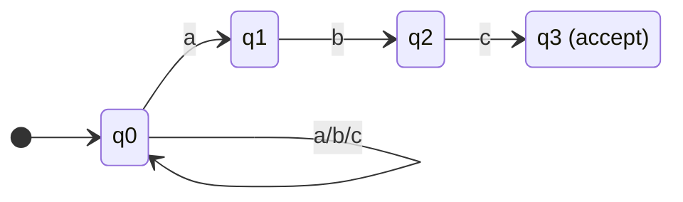
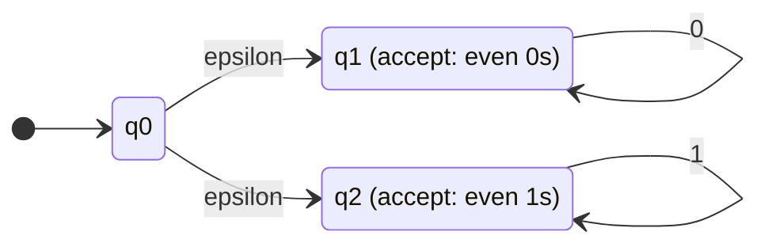
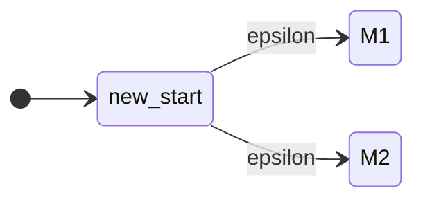
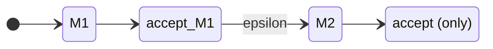
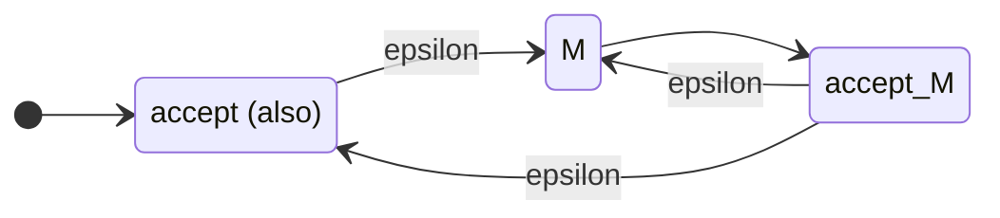

# 08 · NFA와 DFA 등가성

> 비결정성(nondeterminism)은 마법이지만 **표현력은 늘리지 않습니다**. 다만 *설계 편의*는 극적으로 늘립니다.

---

## 8.1 NFA란?

### 정의 8.1 (Nondeterministic Finite Automaton)
NFA는 5-tuple $N = (Q, \Sigma, \delta, q_0, F)$이지만, 전이 함수가:
$$
\delta : Q \times \Sigma_\varepsilon \to \mathcal{P}(Q)
$$
여기서 $\Sigma_\varepsilon = \Sigma \cup \{\varepsilon\}$이고, $\mathcal{P}(Q)$는 $Q$의 멱집합(2장 PDF 참고).

### DFA와의 세 가지 차이

| 차이점 | DFA | NFA |
|:--|:--|:--|
| 다음 상태 수 | 정확히 1개 | 0개 또는 여러 개 |
| $\varepsilon$-전이 | 없음 | 있음 (입력 안 읽고 이동) |
| 모든 (state,input) 정의 | 필수 | 선택 |

### "비결정적"의 의미
같은 입력에 대해 여러 갈래로 동시에 진행 가능. 마지막에 **수용 상태에 도달하는 경로가 단 하나라도 있으면 수용**.

> 비유: 마법사가 미래를 미리 보고 옳은 길을 항상 선택. (실제 구현은 모든 가능성을 동시 시뮬레이션.)

---

## 8.2 NFA의 동작

### 8.2.1 예시 — "abc로 끝나는 문자열" (NFA로 쉽게)



상태 해석:
- $q_0$: 아직 매칭 시작 안 함 (자기 자신으로 a/b/c 모두)
- $q_1, q_2, q_3$: `a`, `ab`, `abc`까지 매칭됨

**DFA로 만들려면?** 진행 중인 부분 매치 상태 4개($\emptyset, \text{a}, \text{ab}, \text{abc}$)를 다 추적해야 → 더 복잡.

### 8.2.2 $\varepsilon$-전이

$\varepsilon$-전이는 입력 없이 자동으로 일어남.



이 NFA는 `0*` 또는 `1*`를 인식. $\varepsilon$-전이로 시작 시점에 어느 쪽을 갈지 *선택*함.

---

## 8.3 NFA의 형식적 언어

### 정의 8.2 ($\varepsilon$-closure)
상태 집합 $S$의 $\varepsilon$-closure $E(S)$:
$$
E(S) = S \cup \{q : \exists s \in E(S),\; q \in \delta(s, \varepsilon)\}
$$

**$\varepsilon$-전이를 따라 도달 가능한 모든 상태의 집합**.

### 확장 전이 $\hat\delta_N$
- $\hat\delta_N(q, \varepsilon) = E(\{q\})$
- $\hat\delta_N(q, wa) = E\Big(\bigcup_{p \in \hat\delta_N(q, w)} \delta(p, a)\Big)$

### NFA가 인식하는 언어
$$
L(N) = \{w \in \Sigma^* : \hat\delta_N(q_0, w) \cap F \neq \emptyset\}
$$

**끝 상태 집합 중 수용 상태가 하나라도 있으면 수용.**

---

## 8.4 **NFA = DFA** — Rabin-Scott 정리

### 정리 8.1 (Subset Construction, 1959)
모든 NFA는 같은 언어를 인식하는 **DFA로 변환할 수 있다.**

### 핵심 아이디어
NFA가 "동시에 여러 상태에 있을 수 있다"면, **DFA의 상태를 NFA의 상태들의 부분집합**으로 잡자.

### 알고리즘 (Subset Construction)

1. **DFA의 상태** = NFA의 상태 부분집합 (멱집합 $\mathcal{P}(Q)$의 원소들 — 최대 $2^{|Q|}$개)
2. **시작 상태** = $E(\{q_0\})$
3. **전이**:
$$
\delta_D(S, a) = E\Big(\bigcup_{q \in S} \delta_N(q, a)\Big)
$$
4. **수용 상태**: $F$ 중 어떤 NFA 상태라도 포함하는 부분집합

### 예시 변환

위 8.2.1의 NFA를 DFA로:

NFA 상태: $\{q_0, q_1, q_2, q_3\}$, 알파벳 $\{a, b, c\}$.

| DFA 상태 (NFA 상태 집합) | $a$ 입력 시 | $b$ 입력 시 | $c$ 입력 시 |
|:--|:--|:--|:--|
| $\{q_0\}$ | $\{q_0, q_1\}$ | $\{q_0\}$ | $\{q_0\}$ |
| $\{q_0, q_1\}$ | $\{q_0, q_1\}$ | $\{q_0, q_2\}$ | $\{q_0\}$ |
| $\{q_0, q_2\}$ | $\{q_0, q_1\}$ | $\{q_0\}$ | $\{q_0, q_3\}$ |
| $\{q_0, q_3\}$ ✓ | $\{q_0, q_1\}$ | $\{q_0\}$ | $\{q_0\}$ |

수용 상태: $q_3$를 포함하는 모든 집합 → $\{q_0, q_3\}$.

DFA 4개 상태로 같은 언어 인식. ✓

### 상태 폭발(State Explosion)
최악의 경우 NFA의 상태가 $n$개면 DFA는 **$2^n$개**까지 폭발 가능. 실제로 polynomial size NFA가 exponential DFA로 변환되는 예시 존재.

> **NFA는 더 작고, DFA는 더 빠릅니다.** 이 트레이드오프 때문에 정규식 엔진은 둘 다 사용.

---

## 8.5 DFA → NFA — 자명

모든 DFA는 이미 NFA입니다 ($\delta_D(q, a) \in Q$를 $\{\delta_D(q,a)\}$로 보면 됨).

### 결론 — **DFA와 NFA는 정확히 같은 클래스의 언어를 인식**

$$
\mathsf{DFA} = \mathsf{NFA} = \mathsf{REG}
$$

---

## 8.6 NFA로 닫힘성 증명이 쉬워지는 이유

7장에서 정규 언어가 $\cup$, $\cap$, $L \cdot L'$, $L^*$에 닫혀있다고 언급. NFA를 쓰면 증명이 **그림 한 장**으로 끝납니다.

### 8.6.1 합집합 $L_1 \cup L_2$



새 시작 상태에서 $\varepsilon$-전이로 두 NFA 중 아무거나 가서 실행.

### 8.6.2 연결 $L_1 \cdot L_2$



$M_1$의 수용 상태에서 $\varepsilon$로 $M_2$의 시작 상태로. 최종 수용 상태는 $M_2$의 것만.

### 8.6.3 Kleene Star $L^*$



새 시작 = 새 수용 ($\varepsilon$ 인식). $M$이 끝나면 다시 $M$의 시작으로 루프.

> **NFA의 진정한 가치**: 표현력이 늘진 않지만, *증명과 구성*이 압도적으로 간결.

---

## 8.7 Python으로 NFA 구현

```python
class NFA:
    def __init__(self, states, alphabet, delta, start, accept):
        """
        delta: {(state, symbol_or_None): set of next states}
               None을 epsilon으로 사용
        """
        self.states = set(states)
        self.alphabet = set(alphabet)
        self.delta = delta
        self.start = start
        self.accept = set(accept)

    def epsilon_closure(self, S):
        stack = list(S)
        closure = set(S)
        while stack:
            q = stack.pop()
            for nxt in self.delta.get((q, None), set()):
                if nxt not in closure:
                    closure.add(nxt)
                    stack.append(nxt)
        return closure

    def step(self, S, ch):
        nxt = set()
        for q in S:
            nxt |= self.delta.get((q, ch), set())
        return self.epsilon_closure(nxt)

    def accepts(self, w: str) -> bool:
        S = self.epsilon_closure({self.start})
        for ch in w:
            S = self.step(S, ch)
            if not S:
                return False
        return bool(S & self.accept)


# 예: "ab"를 부분문자열로 포함하는 NFA
nfa = NFA(
    states={"q0","q1","q2"},
    alphabet={"a","b"},
    delta={
        ("q0","a"): {"q0","q1"},
        ("q0","b"): {"q0"},
        ("q1","b"): {"q2"},
        ("q2","a"): {"q2"},
        ("q2","b"): {"q2"},
    },
    start="q0",
    accept={"q2"},
)
print(nfa.accepts("xab"))    # False (x는 알파벳 외)
print(nfa.accepts("aab"))    # True
print(nfa.accepts("bba"))    # False
print(nfa.accepts("bbab"))   # True
```

### Subset Construction을 코드로

```python
def nfa_to_dfa(nfa: NFA):
    start_set = frozenset(nfa.epsilon_closure({nfa.start}))
    states = {start_set}
    queue = [start_set]
    delta = {}
    accept = set()

    while queue:
        S = queue.pop()
        if S & nfa.accept:
            accept.add(S)
        for ch in nfa.alphabet:
            T = frozenset(nfa.step(S, ch))
            delta[(S, ch)] = T
            if T not in states and T:
                states.add(T)
                queue.append(T)

    return DFA(  # 7장의 DFA 클래스
        states=states,
        alphabet=nfa.alphabet,
        delta=delta,
        start=start_set,
        accept=accept,
    )
```

---

## 8.8 빠른 자기 점검

1. NFA의 상태가 5개일 때, 동치 DFA의 최대 상태 수는?  
   <details><summary>답</summary>$2^5 = 32$. 실제로는 도달 가능한 부분집합만 등장하므로 보통 훨씬 적음.</details>

2. $\varepsilon$-전이가 표현력을 늘리는가?  
   <details><summary>답</summary>아니요. $\varepsilon$-NFA → NFA → DFA 변환이 모두 가능. 결국 같은 언어 클래스.</details>

3. NFA가 어떤 입력에서 모든 갈래가 dead end로 갔다면?  
   <details><summary>답</summary>거부. 수용 상태에 도달하는 경로가 단 하나라도 있어야 수용.</details>

4. "비결정성"을 실제 컴퓨터가 어떻게 시뮬레이션하나?  
   <details><summary>답</summary>현재 가능한 상태들의 **집합**을 유지. 입력 한 글자마다 집합을 갱신. 이게 결국 subset construction의 lazy 버전.</details>

---

## 8.9 실용 — 정규식 엔진의 두 학파

### Thompson NFA + Subset Construction (POSIX, RE2, Rust regex)
- NFA로 컴파일 → 시뮬레이션 (subset 추적)
- 최악 시간: **$O(nm)$** ($n$=입력 길이, $m$=정규식 길이)
- ReDoS(정규식 서비스 거부 공격) **불가능**
- 단점: backreference 등 일부 확장 기능 미지원

### Backtracking (PCRE, Java, Python, JavaScript)
- 재귀 호출로 NFA 시뮬레이션
- 최악 시간 **지수**: catastrophic backtracking → **ReDoS 위험**
- 장점: backreference, lookahead 등 풍부한 기능

> Cloudflare의 2019년 대규모 장애가 정규식의 catastrophic backtracking 때문이었습니다. 그 이후로 그들은 Rust regex (Thompson)로 마이그레이션.

---

## 8.10 실습 예제 — LeetCode

### 🥈 [LeetCode 10. Regular Expression Matching](https://leetcode.com/problems/regular-expression-matching/)

> `.`와 `*`를 지원하는 정규식 매칭 구현.

<details>
<summary>풀이 보기 (DP, 사실상 NFA 시뮬레이션)</summary>

```python
class Solution:
    def isMatch(self, s, p):
        n, m = len(s), len(p)
        dp = [[False] * (m + 1) for _ in range(n + 1)]
        dp[0][0] = True
        # 빈 문자열이 p[:j]에 매칭되는 경우: a*b*c* 같은 경우
        for j in range(2, m + 1):
            if p[j-1] == '*':
                dp[0][j] = dp[0][j-2]
        for i in range(1, n + 1):
            for j in range(1, m + 1):
                if p[j-1] == '*':
                    # 0번 매칭 or 1번 이상 매칭
                    dp[i][j] = dp[i][j-2] or (
                        (p[j-2] == '.' or p[j-2] == s[i-1]) and dp[i-1][j]
                    )
                elif p[j-1] == '.' or p[j-1] == s[i-1]:
                    dp[i][j] = dp[i-1][j-1]
        return dp[n][m]
```

**해설**: 이 DP는 사실 NFA를 시뮬레이션하는 것의 다른 형태. `dp[i][j]`는 "NFA가 입력 첫 i글자를 처리 후 패턴 첫 j글자 상태에 있을 수 있는가?". 정확히 subset construction 비슷한 동작.
</details>

### 🥇 [LeetCode 44. Wildcard Matching](https://leetcode.com/problems/wildcard-matching/)

> `?`와 `*`을 지원하는 wildcard 매칭.

<details>
<summary>풀이 보기</summary>

```python
class Solution:
    def isMatch(self, s, p):
        n, m = len(s), len(p)
        dp = [[False] * (m + 1) for _ in range(n + 1)]
        dp[0][0] = True
        for j in range(1, m + 1):
            if p[j-1] == '*':
                dp[0][j] = dp[0][j-1]
        for i in range(1, n + 1):
            for j in range(1, m + 1):
                if p[j-1] == '*':
                    # *가 빈 문자열 / 한 글자 이상 매칭
                    dp[i][j] = dp[i][j-1] or dp[i-1][j]
                elif p[j-1] == '?' or p[j-1] == s[i-1]:
                    dp[i][j] = dp[i-1][j-1]
        return dp[n][m]
```

**해설**: 10번보다 단순. `*`이 "임의의 문자열 매칭"이라 NFA로 만들면 $\varepsilon$-루프가 명확.
</details>

### 🥈 [LeetCode 28. Find the Index of the First Occurrence](https://leetcode.com/problems/find-the-index-of-the-first-occurrence-in-a-string/)

> 문자열에서 부분 문자열의 첫 위치 찾기 (`strstr`).

<details>
<summary>풀이 보기 (KMP — DFA 사고)</summary>

```python
class Solution:
    def strStr(self, haystack, needle):
        if not needle:
            return 0
        # KMP failure 함수 (DFA의 일종)
        n, m = len(haystack), len(needle)
        fail = [0] * m
        k = 0
        for i in range(1, m):
            while k > 0 and needle[k] != needle[i]:
                k = fail[k-1]
            if needle[k] == needle[i]:
                k += 1
            fail[i] = k
        # 매칭
        k = 0
        for i in range(n):
            while k > 0 and needle[k] != haystack[i]:
                k = fail[k-1]
            if needle[k] == haystack[i]:
                k += 1
            if k == m:
                return i - m + 1
        return -1
```

**해설**: KMP의 `fail` 배열은 사실상 **needle을 인식하는 DFA의 전이 함수**의 압축 표현입니다. "지금까지 매칭한 prefix"가 상태.
</details>

---

➡️ 다음: [09-regex.md](./09-regex.md) — 정규 표현식, 그리고 RE ⇔ FA의 동치성.
