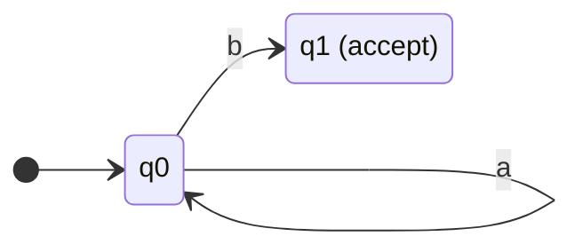

# 09 · 정규 표현식 (Regular Expressions)과 Kleene 정리

> "**정규 표현식이 모든 정규 언어를, 모든 정규 언어가 정규 표현식**으로 표현된다." — Kleene 정리는 이 강의 전체의 가장 중요한 결과입니다.

---

## 9.1 정규 표현식의 형식적 정의

### 정의 9.1 (Regular Expression)
$\Sigma$ 위의 **정규 표현식(regex)**은 다음 규칙으로 귀납 정의됨:

**기저(Base cases)**:
1. $\emptyset$은 정규 표현식 — 빈 언어 인식
2. $\varepsilon$은 정규 표현식 — $\{\varepsilon\}$만 인식
3. 임의의 $a \in \Sigma$는 정규 표현식 — $\{a\}$만 인식

**귀납(Inductive cases)**:
$R_1, R_2$가 정규 표현식이라면:
4. $R_1 + R_2$ (또는 $R_1 \mid R_2$): 합집합 — $L(R_1) \cup L(R_2)$
5. $R_1 R_2$: 연결 — $L(R_1) \cdot L(R_2)$
6. $R_1^*$: Kleene star — $L(R_1)^*$

이게 **전부**입니다. 단순하지만 강력.

### 우선순위

연산 우선순위 (높을수록 먼저):
1. `*` (Kleene star)
2. 연결 (concatenation)
3. `+` 또는 `|` (합집합)

예: $ab^* + c \equiv (a(b^*)) + c$.

### 정의 9.2 (Regex가 인식하는 언어)
$L(R)$ = 위 규칙으로 귀납적으로 결정됨.

---

## 9.2 예시 — 정규 표현식 읽기

| Regex | 인식하는 언어 |
|:--|:--|
| $a$ | $\{a\}$ |
| $ab$ | $\{ab\}$ |
| $a + b$ | $\{a, b\}$ |
| $(a+b)^*$ | $\Sigma^*$ — 모든 문자열 |
| $a^* b^*$ | $a$들 다음에 $b$들 |
| $(ab)^*$ | $\varepsilon, ab, abab, \dots$ |
| $a^* + b^*$ | 전부 $a$이거나 전부 $b$ |
| $aa(a+b)^*bb$ | $aa$로 시작, $bb$로 끝, 가운데는 임의 |
| $(0+1)^* 1 (0+1)^*$ | 1을 적어도 하나 포함 |
| $(0+1)^*$ | 모든 이진 문자열 |
| $(00)^*$ | 짝수 개의 $0$ |
| $(0+1)(0+1)$ | 길이 2 이진 문자열 (4개) |

### 패턴 — "$\dots$를 포함하지 않는다"

조심: 정규 표현식 자체에는 "NOT" 연산자가 *직접* 없습니다.
"$ab$를 포함하지 않는 문자열" 같은 건:
$$
(b + a^* a)^*  \;\; \text{또는} \;\; b^* (ab^*)^*  \cdots
$$
경우에 따라 복잡함. 보집합은 *DFA로 가서 수용 상태 뒤집고 다시 regex 추출*하는 게 정공법.

---

## 9.3 실용 정규식 vs 이론 정규식

| 이론 | 실용 (PCRE, Python re 등) | 의미 |
|:--|:--|:--|
| $a + b$ | `a\|b` | 합집합 |
| $a^*$ | `a*` | 0회 이상 |
| 연결 | 그대로 | concat |
| $(a+b)$ | `(a\|b)` | 그룹 |

실용 정규식의 **추가 기능** (이론 정규식보다 표현력이 강할 수도, 약할 수도 있음):
- `[a-z]` — 문자 클래스 (= $a + b + \dots + z$)
- `a+` — 1회 이상 (= $aa^*$)
- `a?` — 0 또는 1회 (= $\varepsilon + a$)
- `^`, `$` — 줄 처음/끝 (앵커)
- `\1` — backreference (정규 언어 표현력 *초과*. context-sensitive)
- `(?=...)` — lookahead (역시 표현력 초과 가능)

**중요**: backreference와 lookahead가 들어가면 더 이상 정규 언어가 아닙니다.

---

## 9.4 정규식 응용 — 실전 패턴

### IP 주소 (대충)
`(\d{1,3}\.){3}\d{1,3}`

### 이메일 (단순)
`[a-zA-Z0-9._%+-]+@[a-zA-Z0-9.-]+\.[a-zA-Z]{2,}`

### 한국 휴대폰
`01[016-9]-\d{3,4}-\d{4}`

### 변수명 (식별자)
`[a-zA-Z_][a-zA-Z0-9_]*`

### 정수 (부호 옵션)
`-?\d+`

### 부동 소수점
`-?(\d+\.\d*|\.\d+)([eE][+-]?\d+)?`

---

## 9.5 Kleene의 정리 (Kleene's Theorem, 1956)

### 정리 9.1 (Kleene)
언어 $L \subseteq \Sigma^*$에 대해 **다음은 동치**:
1. $L$은 어떤 DFA로 인식됨
2. $L$은 어떤 NFA로 인식됨 (8장에서 1과 2 동치 증명)
3. $L$은 어떤 정규 표현식으로 표현됨

즉:
$$
\boxed{\;\mathsf{DFA} = \mathsf{NFA} = \mathsf{REGEX} = \mathsf{REG}\;}
$$

### 9.5.1 Regex → NFA — Thompson 구성 (Thompson's Construction)

귀납적으로 NFA 구성:

**$\emptyset$**: 시작·수용 둘다 있지만 전이 없음 (수용 도달 불가)

**$\varepsilon$**:
```
[start] --ε--> [accept]
```

**$a \in \Sigma$**:
```
[start] --a--> [accept]
```

**$R_1 + R_2$**: 합집합 NFA (8.6.1 그림 참고)

**$R_1 R_2$**: 연결 NFA (8.6.2)

**$R_1^*$**: Kleene star NFA (8.6.3)

각 단계가 상수 개의 상태와 전이만 추가하므로, **regex 크기 $m$일 때 NFA 상태 수 $O(m)$**.

### 9.5.2 NFA → DFA — Subset construction (8장)

### 9.5.3 DFA → Regex — State Elimination

DFA의 상태들을 하나씩 제거하면서, 잃어버린 경로를 정규식으로 라벨링.

알고리즘 스케치:
1. 시작 상태와 수용 상태를 보존, 나머지 상태들 하나씩 제거
2. 상태 $q_k$를 제거할 때, $q_i \to q_k \to q_j$ 경로를 $q_i \to q_j$의 새 정규식으로 교체:
   $$
   R_{ij} \mathrel{\text{new}} = R_{ij} + R_{ik} (R_{kk})^* R_{kj}
   $$
3. 최종적으로 시작→수용 한 줄의 정규식만 남음

### 9.5.4 결과의 의의

**한 표현법으로 작성한 것을 다른 표현법으로 항상 변환 가능**.

- 사람이 작성하기 쉬운 건 정규식
- 매칭 알고리즘은 DFA가 빠름
- 닫힘성 증명은 NFA가 편함

→ 정규식 엔진은 보통 **regex → NFA → DFA** 파이프라인.

---

## 9.6 정규 언어의 닫힘성 다시보기 (Regex 관점)

| 연산 | Regex로 |
|:--|:--|
| 합집합 | $R_1 + R_2$ |
| 연결 | $R_1 R_2$ |
| Kleene Star | $R^*$ |
| 교집합 | (직접적인 regex 연산자 없음. DFA의 곱 구성으로 증명) |
| 보집합 | (DFA의 수용 뒤집기로 증명) |

> 정규식의 연산자가 정확히 *세 가지*인 이유는, 이게 닫힘성을 보장하면서 모든 정규 언어를 표현하기에 충분하기 때문입니다.

---

## 9.7 예시 — Regex ↔ DFA 변환

### Regex $a^* b$


3개 상태 (사실 q1 다음에 다른 글자가 오면 dead state 1개 추가)로 매우 단순.

### Regex $(a+b)^* aba (a+b)^*$ — "aba를 포함"

DFA로 만들려면 7장의 "부분 문자열 포함" 패턴 적용. 4개 상태 충분.

### Regex $((a+b)(a+b))^*$ — "짝수 길이"

2개 상태 (짝수 길이 상태 = 수용, 홀수 길이 상태). 입력마다 토글.

---

## 9.8 Python `re` 모듈

```python
import re

# 1) 매칭 여부
print(re.fullmatch(r'a*b', 'aaab'))  # 매치 객체
print(re.fullmatch(r'a*b', 'aab c')) # None

# 2) 부분 검색
m = re.search(r'\d+', 'abc 123 def 456')
print(m.group())  # '123'

# 3) 모든 매치
print(re.findall(r'\d+', 'abc 123 def 456'))  # ['123', '456']

# 4) 그룹 추출
m = re.search(r'(\w+)@(\w+)', 'user@example.com')
print(m.group(1), m.group(2))  # user example

# 5) 치환
print(re.sub(r'\s+', ' ', 'hello    world'))  # 'hello world'

# 6) 컴파일 (반복 사용 시 빠름)
pat = re.compile(r'^[A-Z][a-z]+$')
print(pat.match('Alice'))  # 매치
print(pat.match('alice'))  # None
```

### Python re의 주의점
- 기본은 backtracking 엔진 → 악성 패턴에 ReDoS
- 일반 패턴은 매우 빠름 ($O(nm)$ 수준)
- `re2` 라이브러리는 Thompson NFA로 ReDoS 무관

---

## 9.9 빠른 자기 점검

1. $L = \{w \in \{0,1\}^* : w$의 길이가 3의 배수$\}$의 정규식?  
   <details><summary>답</summary>$((0+1)(0+1)(0+1))^*$. 3글자씩 묶음.</details>

2. $L = \{w : w$는 $01$로 시작 또는 $10$으로 끝$\}$의 정규식?  
   <details><summary>답</summary>$01(0+1)^* + (0+1)^* 10$. 합집합.</details>

3. $\emptyset^*$과 $\emptyset$의 차이?  
   <details><summary>답</summary>$\emptyset^* = \{\varepsilon\}$ (한 원소), $\emptyset$ (빈 언어). 다릅니다.</details>

4. $(a+\varepsilon)^* = a^*$?  
   <details><summary>답</summary>예. $\varepsilon$을 0번 이상 붙여도 변화 없음.</details>

5. backreference가 있는 정규식 `(ab)\1`은 어떤 언어?  
   <details><summary>답</summary>$\{abab\}$. 정규 언어이지만, 이를 표현하는 방식 자체는 **정규식의 정의**를 벗어남. 일반적으로 $(.\ast)\backslash 1$은 회문류로 **non-regular** 언어를 표현.</details>

---

## 9.10 실습 예제 — LeetCode

### 🔰 [LeetCode 1408. String Matching in an Array](https://leetcode.com/problems/string-matching-in-an-array/)

> 배열의 문자열 중 다른 문자열의 부분 문자열인 것들 반환.

<details>
<summary>풀이 보기</summary>

```python
class Solution:
    def stringMatching(self, words):
        return [w for w in words if any(w != o and w in o for o in words)]
```

**해설**: Python `in` 연산자가 KMP / Boyer-Moore 등 효율적 알고리즘을 사용. 정규식이 아니라도 부분 문자열 매칭은 정규 언어로 표현 가능.
</details>

### 🥈 [LeetCode 393. UTF-8 Validation](https://leetcode.com/problems/utf-8-validation/)

> 정수 배열이 valid UTF-8 인코딩인지 판단.

<details>
<summary>풀이 보기 (사실상 DFA)</summary>

```python
class Solution:
    def validUtf8(self, data):
        cont = 0  # 남은 continuation byte 수
        for byte in data:
            byte = byte & 0xFF
            if cont == 0:
                if byte >> 5 == 0b110:    cont = 1
                elif byte >> 4 == 0b1110: cont = 2
                elif byte >> 3 == 0b11110: cont = 3
                elif byte >> 7 == 0:      cont = 0  # ASCII
                else: return False
            else:
                if byte >> 6 != 0b10:
                    return False
                cont -= 1
        return cont == 0
```

**해설**: UTF-8 인코딩의 정당성은 사실 정규 언어 (각 위치의 비트 패턴이 정해진 정규식). 상태 = "남은 continuation 수" 5개 정도로 DFA 가능.
</details>

### 🥈 [LeetCode 468. Validate IP Address](https://leetcode.com/problems/validate-ip-address/)

> IPv4/IPv6 주소 형식 검증.

<details>
<summary>풀이 보기 (정규식 활용)</summary>

```python
import re

class Solution:
    def validIPAddress(self, IP: str) -> str:
        ipv4 = re.compile(r'^(?:(?:25[0-5]|2[0-4]\d|1\d\d|[1-9]?\d)\.){3}'
                          r'(?:25[0-5]|2[0-4]\d|1\d\d|[1-9]?\d)$')
        ipv6 = re.compile(r'^(?:[0-9a-fA-F]{1,4}:){7}[0-9a-fA-F]{1,4}$')
        if ipv4.match(IP): return "IPv4"
        if ipv6.match(IP): return "IPv6"
        return "Neither"
```

**해설**: 각 옥텟 (0-255) 자체가 정규 표현식으로 표현 가능 → 전체 주소도 정규식 → DFA로 변환 가능.
</details>

### 🥇 [LeetCode 32. Longest Valid Parentheses](https://leetcode.com/problems/longest-valid-parentheses/)

> 가장 긴 valid 괄호 부분 문자열의 길이.

<details>
<summary>풀이 보기 (스택 — 정규 언어 *아님*)</summary>

```python
class Solution:
    def longestValidParentheses(self, s):
        stack = [-1]  # sentinel
        ans = 0
        for i, ch in enumerate(s):
            if ch == '(':
                stack.append(i)
            else:
                stack.pop()
                if not stack:
                    stack.append(i)
                else:
                    ans = max(ans, i - stack[-1])
        return ans
```

**학습 포인트**: 균형 잡힌 괄호는 **non-regular**. 정규식이나 DFA로 해결 불가능. 스택(즉, PDA)이 필요. 이 문제 자체가 "정규 언어 한계"를 보여줍니다.
</details>

---

➡️ 다음: [10-pumping-lemma-chomsky.md](./10-pumping-lemma-chomsky.md) — 정규 언어가 *못 하는 것*을 수학적으로 증명하기.
