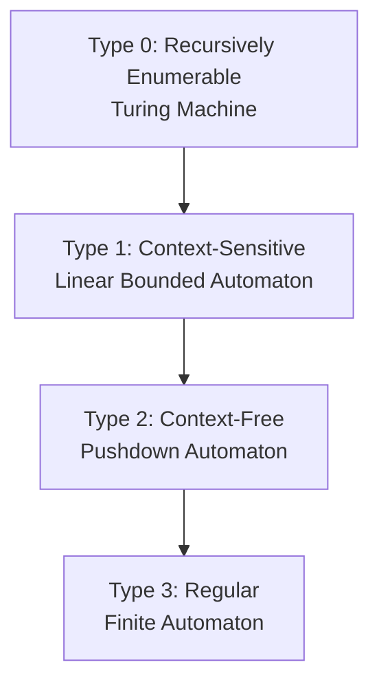

# 10 · 펌핑 보조정리(Pumping Lemma)와 촘스키 계층

> "정규 언어가 **할 수 없는 것**이 무엇인지 정확히 어떻게 증명할까?" 이 질문에 대한 답이 **펌핑 보조정리**입니다.

---

## 10.1 동기 — Non-Regular Language의 증명

다음 언어가 정규가 아님을 어떻게 증명할까?
$$
L = \{0^n 1^n : n \ge 0\} = \{\varepsilon, 01, 0011, 000111, \dots\}
$$

직관적으로는 "DFA가 무한히 깊이를 세야 하는데 상태가 유한이라 안 됨"이지만, 수학적으로 엄밀한 증명이 필요합니다.

---

## 10.2 펌핑 보조정리 (Pumping Lemma for Regular Languages)

### 정리 10.1
$L$이 정규 언어라면, 어떤 **펌핑 길이(pumping length)** $p \ge 1$이 존재하여:

모든 문자열 $w \in L$ with $|w| \ge p$는 $w = xyz$로 분해 가능하고 다음을 만족:
1. $|xy| \le p$
2. $|y| \ge 1$ (즉 $y \neq \varepsilon$)
3. 모든 $i \ge 0$에 대해 $xy^i z \in L$

### 직관

$|w| \ge p$이고 DFA의 상태 수가 $p$ 이하라면, 비둘기집 원리(pigeonhole)에 의해 처음 $p$글자를 읽는 동안 **어떤 상태를 반드시 두 번 방문**합니다.

```
q0 ──x──> qk ──y──> qk ──z──> qf
                ↑
        같은 상태 두 번
```

이 사이클 부분 $y$를 0번, 1번, 2번, ... 반복해도 같은 끝 상태에 도달 → 모든 $xy^iz$가 수용됩니다.

### 핵심 — 게임으로 보기

펌핑 보조정리는 **반증(non-regular 증명)**에 쓰는 도구입니다. 게임처럼 보면:

1. 상대(adversary): 펌핑 길이 $p$를 선택
2. 당신: $|w| \ge p$인 $w \in L$ 선택 (영리하게)
3. 상대: $w = xyz$ 분할 ($|xy| \le p$, $|y| \ge 1$) 선택
4. 당신: $i$를 선택해서 $xy^iz \notin L$임을 보임

당신이 이기면 → $L$은 정규가 아닙니다.

---

## 10.3 응용 1 — $L = \{0^n 1^n\}$이 정규가 아님 증명

**가정**: $L$이 정규라고 가정 (반증법).

펌핑 보조정리로 $p$가 존재.

**문자열 선택**: $w = 0^p 1^p \in L$. $|w| = 2p \ge p$.

**모든 분할 $w = xyz$**에 대해 ($|xy| \le p$이므로 $x$와 $y$ 모두 처음 $p$글자 = 모두 $0$):
- $x = 0^a$, $y = 0^b$ ($b \ge 1$), $z = 0^{p-a-b} 1^p$

**$i = 2$ 선택**:
$$
xy^2z = 0^a \cdot 0^{2b} \cdot 0^{p-a-b} 1^p = 0^{p+b} 1^p
$$
$b \ge 1$이므로 0의 개수가 1의 개수보다 많음 → $xy^2z \notin L$.

모순 → $L$은 정규가 아님. $\blacksquare$

---

## 10.4 응용 2 — 회문 (Palindrome)이 정규가 아님

$L = \{w \in \{0,1\}^* : w = w^R\}$

**문자열 선택**: $w = 0^p 1 0^p \in L$.

$|xy| \le p$이므로 $xy$는 처음 $p$ 0들의 일부 → $y = 0^b$ ($b \ge 1$).

$i = 0$: $xy^0 z = xz = 0^{p-b} 1 0^p$. 이건 회문이 아님 (왼쪽 0의 개수 $p-b$ < 오른쪽 $p$).

→ $L$은 정규가 아님. $\blacksquare$

---

## 10.5 응용 3 — $L = \{a^n : n$은 소수$\}$가 정규가 아님

이건 더 까다롭습니다. 펌핑 보조정리를 적용:

**$w = a^p$**에서 $p$가 소수가 되도록 (소수가 무한히 많으므로 가능).

$w = xyz$, $y = a^b$, $b \ge 1$.

$xy^iz = a^{|x|+i \cdot b + |z|} = a^{p + (i-1)b}$.

$i = p+1$ 선택:
$$
|xy^{p+1}z| = p + p \cdot b = p(1+b)
$$
$1+b \ge 2$이고 $p \ge 2$이므로 $p(1+b)$는 **합성수**.

→ $xy^{p+1}z \notin L$. $\blacksquare$

---

## 10.6 사용 시 주의

펌핑 보조정리는 **필요 조건**입니다 (정규 ⇒ 펌핑 가능). 역은 거짓 — 펌핑 보조정리를 만족하지만 비정규인 언어도 존재.

그러나 펌핑 보조정리의 진가는:
- 비정규임을 보이는 표준 도구 (대부분의 비정규 언어에 작동)
- 좀 더 강력한 도구로 **Myhill-Nerode 정리**가 있음 (정규성에 대한 필요충분 조건)

---

## 10.7 Myhill-Nerode 정리 (간략)

### 정의 10.1 ($L$에 대한 분간 가능 — distinguishable)
두 문자열 $x, y \in \Sigma^*$가 $L$에 대해 분간 가능이려면, 어떤 $z \in \Sigma^*$가 존재하여:
$$
xz \in L \;\;\not\Leftrightarrow\;\; yz \in L
$$
(둘 중 하나만 $L$에 있음)

### 정리 10.2 (Myhill-Nerode)
$L$이 정규일 필요충분조건:
$\sim_L$ ("서로 분간 불가능") 동치관계가 **유한 개의 동치류**를 가짐.

그리고 이 동치류의 개수 = **최소 DFA의 상태 수**.

### 응용 — $\{0^n 1^n\}$이 정규가 아님 다시

서로 다른 $i \neq j$에 대해 $0^i$와 $0^j$는 분간 가능: $z = 1^i$ 선택하면 $0^i \cdot 1^i \in L$이지만 $0^j \cdot 1^i \notin L$.

따라서 $0^0, 0^1, 0^2, \dots$가 모두 서로 다른 동치류 → 무한 개의 동치류 → 비정규. $\blacksquare$

> 펌핑 보조정리는 망치, Myhill-Nerode는 정밀 드라이버.

---

## 10.8 정규 언어 너머 — Chomsky Hierarchy

Noam Chomsky(1956)는 형식 언어를 4단계 계층으로 분류했습니다.

| 타입 | 언어 클래스 | 인식 기계 | 문법 형식 | 예시 |
|:--:|:--|:--|:--|:--|
| 3 | Regular | DFA/NFA | $A \to aB$ or $A \to a$ | $a^* b^*$ |
| 2 | Context-Free (CFL) | PDA (스택) | $A \to \gamma$ | $\{0^n 1^n\}$, 괄호 |
| 1 | Context-Sensitive | LBA | $\alpha A \beta \to \alpha \gamma \beta$ | $\{a^n b^n c^n\}$ |
| 0 | Recursively Enumerable | TM | 임의 규칙 | TM이 받아들이는 모든 것 |

### 시각화



각 클래스는 위의 클래스를 **진부분집합(proper subset)**으로 포함합니다.

---

## 10.9 Context-Free Languages 미리보기

### Context-Free Grammar (CFG)
규칙: $A \to \gamma$ 형태. $A$는 비종단(nonterminal), $\gamma$는 종단과 비종단의 임의 문자열.

#### 예 — 균형 잡힌 괄호
$$
S \to (\,S\,) \mid SS \mid \varepsilon
$$

이 문법은 임의 깊이의 중첩을 표현 → 정규로 못 합니다.

#### 예 — 산술식 (단순)
$$
E \to E + E \mid E \cdot E \mid (E) \mid \mathbf{id}
$$

### PDA (Pushdown Automaton)
DFA + **스택**. 입력을 읽으면서 스택에 push/pop 가능.

괄호 매칭: 여는 괄호 push, 닫는 괄호 pop, 끝에 스택이 비었으면 수용.

### CFL의 응용
- **컴파일러 파싱**: 거의 모든 프로그래밍 언어의 문법은 CFG
- **XML/HTML 파싱**
- **수식 평가**

---

## 10.10 Context-Sensitive와 그 너머

### Context-Sensitive Grammar
규칙이 **문맥에 의존**: $\alpha A \beta \to \alpha \gamma \beta$.

예: $\{a^n b^n c^n : n \ge 1\}$.

### LBA (Linear Bounded Automaton)
입력 길이에 비례하는 메모리만 사용하는 튜링 기계. PDA보다 강력, TM보다 약함.

### Type 0 — Turing Machine
무제한 메모리. 알고리즘이라 부르는 모든 것을 표현.

**Church-Turing 명제**: "효과적으로 계산 가능한 모든 함수는 튜링 기계로 계산 가능."

### 결정 불가능한 문제 (Undecidable)
TM조차도 풀 수 없는 문제가 있습니다:
- **정지 문제(Halting Problem)**: "이 프로그램이 멈출까?" (Turing, 1936)
- **타입 추론** (Hindley-Milner의 일부 확장)
- **포스트 대응 문제(PCP)**
- **Rice's theorem**: TM의 비-자명한 의미적 속성은 모두 결정 불가능

> 컴퓨터로 풀 수 있는 문제의 한계는 이산수학 + 오토마타 + 계산이론의 끝판왕입니다.

---

## 10.11 시각 비교 — 같은 문제, 다른 기계

| 문제 | DFA | PDA | TM |
|:--|:--:|:--:|:--:|
| 짝수 개의 0 | O | O | O |
| `(0+1)*1(0+1)*` | O | O | O |
| $\{0^n 1^n\}$ | X | O | O |
| 균형 잡힌 괄호 | X | O | O |
| 회문 | X | O | O |
| $\{a^n b^n c^n\}$ | X | X | O |
| $\{ww : w \in \Sigma^*\}$ | X | X | O |
| 소수성 판별 | X | X | O |
| 정지 문제 | X | X | X |

구체적이지만 결정 불가능한 문제들이 존재합니다 — 이게 이산수학·계산이론의 가장 깊은 결과 중 하나.

---

## 10.12 빠른 자기 점검

1. $L = \{0^n 1^m : n, m \ge 0\}$는 정규인가?  
   <details><summary>답</summary>예. 정규식 $0^* 1^*$.</details>

2. $L = \{0^n 1^m : n \ge m\}$는 정규인가?  
   <details><summary>답</summary>아니요. 펌핑 보조정리로 증명: $w = 0^p 1^p$. $i=0$ 선택. $y = 0^b$ ($b \ge 1$). $xy^0z = 0^{p-b} 1^p$. $p-b < p$이므로 $\notin L$. 비정규.</details>

3. $L = \{w \in \{0,1\}^* : w$의 0 개수와 1 개수가 같음$\}$는 어느 클래스?  
   <details><summary>답</summary>Context-Free (PDA로 인식). 정규 아님.</details>

4. Chomsky 계층의 각 클래스는 진부분집합인가?  
   <details><summary>답</summary>예. 모든 포함이 strict. $\{0^n 1^n\}$은 CFL이지만 regular은 아님. $\{a^n b^n c^n\}$은 CS이지만 CFL은 아님.</details>

5. 결정 불가능 문제는 알고리즘이 *느린* 문제인가?  
   <details><summary>답</summary>아닙니다. 알고리즘이 아예 존재하지 않는 문제. 시간이 무한히 주어져도 불가능.</details>

---

## 10.13 C++로 펌핑 보조정리 시뮬레이션

```cpp
#include <bits/stdc++.h>
using namespace std;

// L = {0^n 1^n} 멤버십 검사
bool is_in_L(const string& w) {
    int n = 0;
    while (n < (int)w.size() && w[n] == '0') ++n;
    int m = 0;
    while (n + m < (int)w.size() && w[n + m] == '1') ++m;
    return n + m == (int)w.size() && n == m;
}

// 주어진 w에 대해, 모든 펌핑 분할을 시도해 깨지는 i를 찾기
bool disprove_regular(bool (*L_check)(const string&), const string& w) {
    int n = w.size();
    for (int split = 1; split <= n; ++split) {           // |xy| = split
        for (int y_start = 0; y_start < split; ++y_start) {
            string x = w.substr(0, y_start);
            string y = w.substr(y_start, split - y_start);
            string z = w.substr(split);
            if (y.empty()) continue;
            cout << "x=\"" << x << "\" y=\"" << y << "\" z=\"" << z << "\"\n";
            for (int i : {0, 2, 3}) {
                string pumped = x;
                for (int k = 0; k < i; ++k) pumped += y;
                pumped += z;
                if (!L_check(pumped)) {
                    cout << "  i=" << i << ": \"" << pumped
                         << "\" not in L  <- broken!\n";
                    return true;
                }
            }
        }
    }
    return false;
}

int main() {
    string w = "0000011111";  // n=5
    cout << "w = " << w << " (|w|=" << w.size() << ")\n";
    disprove_regular(is_in_L, w);
}
```

> 펌핑 보조정리는 이론이지만, 위 코드처럼 모든 분할을 시뮬레이션해 직접 반증할 수도 있습니다.

---

## 10.14 마무리 — 무엇을 배웠나

이번 4개 챕터(06~10)를 통해 우리는:

1. **언어 = 문자열의 집합**임을 형식화 (Week 2 집합론의 연장)
2. **DFA**가 가장 단순한 추상 기계임을 정의
3. **NFA = DFA** — 비결정성은 표현력을 늘리지 않음 (Rabin-Scott)
4. **Regex = FA** — 두 표현법이 동등함 (Kleene)
5. **펌핑 보조정리**로 정규 언어의 한계를 증명
6. **Chomsky 계층**으로 계산 능력의 거대한 그림을 그림

이제 컴파일러의 lexer가 어떻게 작동하는지, 정규식 엔진의 한계가 어디인지, 왜 어떤 문제는 알고리즘이 없는지 — 답할 수 있는 도구가 생겼습니다.

---

## 10.15 실습 예제 — LeetCode

### [LeetCode 20. Valid Parentheses](https://leetcode.com/problems/valid-parentheses/)

> 괄호 `()[]{}` 등이 올바르게 매칭되는지.

<details>
<summary>풀이 보기 (Context-Free 언어의 전형)</summary>

```cpp
class Solution {
public:
    bool isValid(string s) {
        stack<char> st;
        unordered_map<char,char> pair_ = {{')','('}, {']','['}, {'}','{'}};
        for (char ch : s) {
            if (ch == '(' || ch == '[' || ch == '{') {
                st.push(ch);
            } else {
                if (st.empty() || st.top() != pair_[ch]) return false;
                st.pop();
            }
        }
        return st.empty();
    }
};
```

이 문제 자체가 non-regular language의 결정 문제. 스택(=PDA)이 필요합니다. 펌핑 보조정리로 정규가 아님을 증명할 수 있습니다.
</details>

### [LeetCode 678. Valid Parenthesis String](https://leetcode.com/problems/valid-parenthesis-string/)

> 괄호에 `*` (와일드카드)가 섞인 문자열의 매칭 가능 여부.

<details>
<summary>풀이 보기</summary>

```cpp
class Solution {
public:
    bool checkValidString(string s) {
        int lo = 0, hi = 0;
        for (char ch : s) {
            if (ch == '(')      { ++lo; ++hi; }
            else if (ch == ')') { --lo; --hi; }
            else                { --lo; ++hi; }  // '*'
            if (hi < 0) return false;
            lo = max(lo, 0);
        }
        return lo == 0;
    }
};
```

그리디 풀이. NFA처럼 "동시에 가능한 상태"를 압축해서 추적.
</details>

### [LeetCode 224. Basic Calculator](https://leetcode.com/problems/basic-calculator/)

> `(1+(4+5+2)-3)+(6+8)` 같은 산술식 계산.

<details>
<summary>풀이 보기 (PDA가 필요한 전형)</summary>

```cpp
class Solution {
public:
    int calculate(string s) {
        stack<int> st;
        int num = 0, sign = 1, result = 0;
        for (char ch : s) {
            if (isdigit(ch)) {
                num = num * 10 + (ch - '0');
            } else if (ch == '+' || ch == '-') {
                result += sign * num;
                num = 0;
                sign = (ch == '+') ? 1 : -1;
            } else if (ch == '(') {
                st.push(result);
                st.push(sign);
                result = 0;
                sign = 1;
            } else if (ch == ')') {
                result += sign * num;
                num = 0;
                result *= st.top(); st.pop();   // prev sign
                result += st.top(); st.pop();   // prev result
            }
        }
        return result + sign * num;
    }
};
```

임의 깊이의 괄호 → CFL. 스택 필수.
</details>

### [LeetCode 726. Number of Atoms](https://leetcode.com/problems/number-of-atoms/)

> 화학식 `K4(ON(SO3)2)2` 같은 걸 원자별 개수로 분해.

<details>
<summary>풀이 보기</summary>

```cpp
class Solution {
public:
    string countOfAtoms(string formula) {
        stack<map<string,int>> st;
        st.push({});
        int n = formula.size(), i = 0;
        while (i < n) {
            char ch = formula[i];
            if (ch == '(') {
                st.push({});
                ++i;
            } else if (ch == ')') {
                ++i;
                int num = 0;
                while (i < n && isdigit(formula[i])) {
                    num = num * 10 + (formula[i] - '0'); ++i;
                }
                if (num == 0) num = 1;
                map<string,int> top = st.top(); st.pop();
                for (auto& [atom, cnt] : top) st.top()[atom] += cnt * num;
            } else {
                int j = i + 1;
                while (j < n && islower(formula[j])) ++j;
                string atom = formula.substr(i, j - i);
                i = j;
                int num = 0;
                while (i < n && isdigit(formula[i])) {
                    num = num * 10 + (formula[i] - '0'); ++i;
                }
                if (num == 0) num = 1;
                st.top()[atom] += num;
            }
        }
        string out;
        for (auto& [atom, cnt] : st.top()) {
            out += atom;
            if (cnt > 1) out += to_string(cnt);
        }
        return out;
    }
};
```

본격 PDA 문제. 정규식으로 절대 풀 수 없음. 이번 챕터의 핵심 결과인 Chomsky 계층을 코드로 체감할 수 있습니다.
</details>

---

마지막: [11-practice.md](./11-practice.md) — 종합 실습 + 학습 정리.
