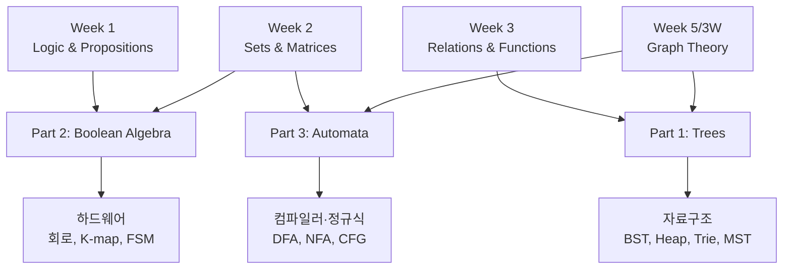
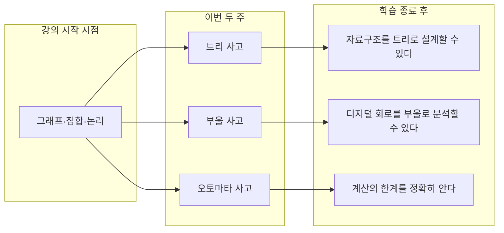

# 11 · 종합 실습 & 학습 정리

> 5개 챕터를 마쳤습니다. 이번엔 챕터를 가로지르는 종합 문제와, 학습 전체를 회고하는 자료입니다.

---

## 11.1 학습 정리 — 한 장으로 보는 Week 4-5

### Big Picture

### 핵심 5가지 (꼭 기억)

1. **트리 = 사이클 없는 연결 그래프.** $|E| = |V| - 1$.
2. **BST/Heap/Trie/MST** — 모두 트리에 *순서·우선순위·문자·가중치*를 더한 것.
3. **부울 대수 = 명제 논리의 대수.** 회로 설계의 수학.
4. **Kleene 정리: DFA = NFA = Regex.** 같은 표현력을 가진 세 가지 도구.
5. **펌핑 보조정리 + Chomsky 계층** — 계산 능력의 위계는 정확히 정의되어 있음.

---

## 11.2 챕터별 핵심 공식·정의 카드

Trees

- 트리 동치 정의: 연결 + 사이클 없음 ⇔ 두 정점 사이 유일 경로 ⇔ 연결 + $|E|=|V|-1$
- Perfect binary tree: 노드 $2^{h+1}-1$개, leaf $2^h$개
- 순회: Preorder(NLR), Inorder(LNR), Postorder(LRN), BFS(level)
- BST: 좌 < 자기 < 우, in-order = 정렬
- Heap: complete binary tree, parent >= children (max-heap)
- Trie: 간선에 문자, 검색 O(L) 단어 수와 무관
- MST: Kruskal (간선 정렬 + Union-Find), Prim (정점 확장 + heap), 둘 다 $O(E \log V)$
- Cut property: cut 중 최소 가중치 간선은 어떤 MST에 포함

Boolean Algebra

- 부울 대수 = $(B, +, \cdot, ', 0, 1)$, $B = \{0,1\}$
- 대응: $+$↔OR↔$\lor$, $\cdot$↔AND↔$\land$, $'$↔NOT↔$\neg$
- 핵심 항등식: Identity, Domination, Idempotent, Complement, De Morgan, Absorption, Distributive
- SOP: 1-row의 minterm의 OR
- POS: 0-row의 maxterm의 AND
- K-map: 인접한 1들을 2의 거듭제곱 크기로 묶음
- NAND, NOR은 **functionally complete** (이것만으로 모든 함수)
- $f$의 변수가 $n$개 → 가능한 함수 수 $2^{2^n}$

Automata

- DFA = $(Q, \Sigma, \delta, q_0, F)$, $\delta: Q \times \Sigma \to Q$
- NFA: $\delta: Q \times \Sigma_\varepsilon \to \mathcal{P}(Q)$
- Subset construction: NFA→DFA, 최대 $2^n$개 상태
- Kleene: DFA = NFA = Regex (정규 언어)
- 정규 언어는 $\cup, \cap, \setminus, ^c, \cdot, ^*$에 닫힘
- 펌핑 보조정리: $\exists p$, $|w| \ge p$ ⇒ $w = xyz$, $|xy| \le p$, $|y| \ge 1$, 모든 $i$에 $xy^iz \in L$
- Chomsky 계층: Regular ⊊ Context-Free ⊊ Context-Sensitive ⊊ Recursively Enumerable

---

## 11.3 종합 도전 문제 — 챕터를 가로지르는 사고

### Problem 1 — 트리에서 BFS = NFA?

**질문**: BFS로 트리를 순회할 때, 큐(queue)는 어떤 면에서 NFA의 시뮬레이션과 닮았을까?

해설

NFA를 시뮬레이션할 때는 "현재 가능한 상태들의 집합"을 추적합니다 (8장). BFS도 매 단계 "현재 깊이의 노드들의 집합"을 큐에 가지고 있습니다.

차이:
- NFA의 집합은 자동 합쳐짐 (같은 상태는 한 번만)
- BFS의 큐는 노드별 구분 유지

그러나 둘 다 **레벨(또는 입력 글자) 단위 동기적 진행**이라는 점에서 본질적으로 같은 패러다임. NFA 시뮬레이션은 사실 BFS의 한 종류.

### Problem 2 — 부울 함수로 표현되는 회로 vs 정규 언어

**질문**: $n$비트 입력을 받아 0/1 출력하는 부울 회로는 모든 정규 언어를 표현할 수 있는가?

해설

**조건**: 길이 $n$이 *고정*되어 있다면 — 예. $n$비트의 모든 입력 조합 $2^n$개에 대해 진리표를 그리고 SOP로 만들면 회로 완성.

**하지만** "정규 언어"는 임의 길이 문자열을 다룹니다 ($\Sigma^*$). 고정 크기 회로 하나로는 임의 길이 입력을 못 받음 → 입력 길이마다 다른 회로 필요.

**해결책**: 회로 family $\{C_n\}_{n=0}^\infty$ — 각 $n$마다 $n$비트 입력 회로. 이걸 uniform circuit family로 만들면, 그 자체로 DFA에 대응됩니다 (Sipser 교과서 참고).

결론: 길이별로 회로를 *변화시킬 수 있다면* (= 시퀀셜 회로, 즉 메모리 추가) 정규 언어 = DFA = 시퀀셜 회로.

> 부울 회로(조합) + 메모리 = 시퀀셜 회로 = FSM = DFA. 디지털 시스템 설계의 본질.

### Problem 3 — Trie와 DFA의 관계

**질문**: 유한 문자열의 집합 $S$를 인식하는 최소 DFA는, $S$에 대한 Trie와 어떻게 다른가?

해설

Trie:
- $S$의 모든 단어의 prefix를 노드로 가짐
- $|S|$의 총 길이 = 트라이 크기

DFA:
- 같은 언어 인식
- suffix를 공유하는 부분도 합쳐짐

예: $S = \{cat, car, bat, bar\}$
- Trie: 12개 노드 (각 단어 4글자 * 4 - 공통 시작...)
- 최소 DFA: 더 적음. `at`과 `ar`의 마지막 부분이 공유될 수 있음.

이걸 **DAWG (Directed Acyclic Word Graph)** 또는 **finite-state transducer**라고 부릅니다. 사전 압축, 자연어 처리 형태소 분석에 사용.

> Trie는 prefix만 압축, 최소 DFA는 suffix도 압축.

### Problem 4 — MST와 Cut Property — Greedy의 일반화

**질문**: Kruskal/Prim이 정확히 같은 MST를 출력하지 않을 수도 있는 이유는?

해설

가중치가 모두 다르면 → MST는 유일.

가중치가 같은 간선이 있으면 → 여러 MST 가능. Kruskal과 Prim은 같은 가중치 간선들 사이 선택 순서가 달라 다른 결과 낼 수 있음.

하지만 **모든 MST의 총 가중치는 같다** (당연 — 최소이므로).

이건 Cut Property의 미묘한 점: "*어떤* MST에 포함된다"고 했지 "*모든* MST"는 아닙니다.

응용: 알고리즘 디버깅 시 "내 MST가 표준 답과 다르네?" — 가중치 합만 같으면 둘 다 정답.

### Problem 5 — Chomsky 계층과 프로그래밍 언어

**질문**: 왜 대부분의 프로그래밍 언어 문법은 Context-Free이지만, 의미는 그렇지 않은가?

해설

**문법(syntax)**: 괄호 매칭, 중첩된 블록, 산술식 — 전부 CFL. CFG로 정의 가능 → PDA로 파싱 가능.

**의미(semantics)**:
- 변수 사용 전 선언 — context-sensitive
- 타입 일치 검사 — context-sensitive  
- 무한 루프 종료 검사 — 결정 불가능 (정지 문제)

그래서 컴파일러는:
1. Lexer (DFA) — 토큰 분해
2. Parser (PDA) — 문법 트리 구성
3. Semantic analyzer (CSL 영역) — 타입 검사, 변수 binding
4. Optimizer/CodeGen (heuristic) — 결정 불가능 영역도 손대지만 *근사적*으로만

Chomsky 계층이 컴파일러 구조를 결정합니다.

---

## 11.4 LeetCode 종합 트랙 — 학습 로드맵

### Tier 1 — 기본기 (10문제)
| 주제 | 문제 |
|:--|:--|
| 트리 순회 | [LeetCode 94](https://leetcode.com/problems/binary-tree-inorder-traversal/), [104](https://leetcode.com/problems/maximum-depth-of-binary-tree/), [102](https://leetcode.com/problems/binary-tree-level-order-traversal/) |
| BST | [LeetCode 700](https://leetcode.com/problems/search-in-a-binary-search-tree/), [98](https://leetcode.com/problems/validate-binary-search-tree/) |
| 비트 연산 | [LeetCode 191](https://leetcode.com/problems/number-of-1-bits/), [136](https://leetcode.com/problems/single-number/) |
| 정규식 | [LeetCode 1408](https://leetcode.com/problems/string-matching-in-an-array/), [125](https://leetcode.com/problems/valid-palindrome/) |
| FSM | [LeetCode 1576](https://leetcode.com/problems/replace-all-s-to-avoid-consecutive-repeating-characters/) |

### Tier 2 — 자료구조 응용 (15문제)
| 주제 | 문제 |
|:--|:--|
| Heap | [LeetCode 215](https://leetcode.com/problems/kth-largest-element-in-an-array/), [347](https://leetcode.com/problems/top-k-frequent-elements/), [295](https://leetcode.com/problems/find-median-from-data-stream/) |
| Trie | [LeetCode 208](https://leetcode.com/problems/implement-trie-prefix-tree/), [212](https://leetcode.com/problems/word-search-ii/), [648](https://leetcode.com/problems/replace-words/) |
| Union-Find | [LeetCode 547](https://leetcode.com/problems/number-of-provinces/), [684](https://leetcode.com/problems/redundant-connection/), [1971](https://leetcode.com/problems/find-if-path-exists-in-graph/) |
| MST | [LeetCode 1584](https://leetcode.com/problems/min-cost-to-connect-all-points/), [1631](https://leetcode.com/problems/path-with-minimum-effort/), [778](https://leetcode.com/problems/swim-in-rising-water/) |
| 부울 회로 | [LeetCode 137](https://leetcode.com/problems/single-number-ii/), [201](https://leetcode.com/problems/bitwise-and-of-numbers-range/), [371](https://leetcode.com/problems/sum-of-two-integers/) |

### Tier 3 — 본격 오토마타 (15문제)
| 주제 | 문제 |
|:--|:--|
| DFA 모델링 | [LeetCode 8 (atoi)](https://leetcode.com/problems/string-to-integer-atoi/), [65 (Valid Number)](https://leetcode.com/problems/valid-number/), [393 (UTF-8)](https://leetcode.com/problems/utf-8-validation/) |
| 정규식 매칭 | [LeetCode 10](https://leetcode.com/problems/regular-expression-matching/), [44](https://leetcode.com/problems/wildcard-matching/) |
| KMP 알고리즘 | [LeetCode 28](https://leetcode.com/problems/find-the-index-of-the-first-occurrence-in-a-string/), [214](https://leetcode.com/problems/shortest-palindrome/) |
| Aho-Corasick 류 | [LeetCode 1032](https://leetcode.com/problems/stream-of-characters/) |
| CFL (스택) | [LeetCode 20](https://leetcode.com/problems/valid-parentheses/), [32](https://leetcode.com/problems/longest-valid-parentheses/), [678](https://leetcode.com/problems/valid-parenthesis-string/) |
| 산술식 파싱 | [LeetCode 224](https://leetcode.com/problems/basic-calculator/), [227](https://leetcode.com/problems/basic-calculator-ii/), [772](https://leetcode.com/problems/basic-calculator-iii/) |
| 화학식 (CFL) | [LeetCode 726](https://leetcode.com/problems/number-of-atoms/) |
| IP 검증 | [LeetCode 468](https://leetcode.com/problems/validate-ip-address/) |

### Tier 4 — 고급 통합 (10문제)
| 주제 | 문제 |
|:--|:--|
| 트리 DP | [LeetCode 124](https://leetcode.com/problems/binary-tree-maximum-path-sum/), [968](https://leetcode.com/problems/binary-tree-cameras/) |
| BST 고급 | [LeetCode 99](https://leetcode.com/problems/recover-binary-search-tree/), [108](https://leetcode.com/problems/convert-sorted-array-to-binary-search-tree/) |
| 비트 DP | [LeetCode 1494](https://leetcode.com/problems/parallel-courses-ii/), [847](https://leetcode.com/problems/shortest-path-visiting-all-nodes/) |
| MST 응용 | [LeetCode 1489 (Critical edges)](https://leetcode.com/problems/find-critical-and-pseudo-critical-edges-in-minimum-spanning-tree/) |
| Sparse Table / LCA | [LeetCode 1483](https://leetcode.com/problems/kth-ancestor-of-a-tree-node/) |
| 컴파일러형 | [LeetCode 736 (Lisp)](https://leetcode.com/problems/parse-lisp-expression/) |
| 동적 정규식 | [LeetCode 132 Pattern](https://leetcode.com/problems/132-pattern/) |

---

## 11.5 추가 학습 자료

### 책
- **Rosen, Discrete Mathematics and Its Applications** (8th ed.) — 이 강의의 기본 교재
- **Sipser, Introduction to the Theory of Computation** — 오토마타 표준 교과서
- **Hopcroft, Motwani, Ullman, Introduction to Automata Theory, Languages, and Computation**
- **Cormen et al., Introduction to Algorithms (CLRS)** — 알고리즘의 바이블

### 온라인
- **NPTEL / Coursera 자동기계 강의** (MIT, Stanford)
- **JFLAP** — DFA/NFA/CFG를 시각적으로 그리고 시뮬레이션할 수 있는 무료 도구
- **regex101.com** — 정규식 시각적 디버거
- **Visualgo.net** — 트리 알고리즘 시각화

### 도구
- **ANTLR**, **Lark** — CFG 파서 라이브러리
- **Google RE2** — 안전한 정규식 엔진 (Thompson NFA 기반)
- **Graphviz** — DFA/트리 다이어그램 자동 생성

---

## 11.6 마지막 정리 — 이 두 챕터에서 얻어가는 것

### 여러분이 이제 할 수 있는 일

1. 이진 트리 문제를 보면 순회의 종류를 떠올린다
2. 복잡한 if문을 보면 K-map으로 단순화를 시도한다
3. 파싱 문제를 보면 "이건 정규? CFL?"을 먼저 묻는다
4. 알고리즘이 안 풀리면 "이게 결정 불가능에 가까운가?"를 의심한다

---

## 11.7 다음 단계 — 알고리즘 이후

이 강의를 마쳤다면, 다음 코스로 자연스럽게 연결됩니다:

- **자료구조** — 트리/그래프 자료구조의 심화
- **알고리즘** — DP, Greedy, Network Flow, NP-completeness
- **운영체제** — 프로세스 상태(FSM), 페이지 교체 알고리즘
- **컴파일러** — Lexer(DFA), Parser(PDA), 코드 생성
- **계산 이론** — Turing 기계, 계산 복잡도, 결정 불가능
- **디지털 시스템 설계** — 부울 회로, FSM, 동기 시퀀셜 시스템
- **이론 컴퓨터 과학** — 형식 검증, 모델 체킹, 정리 증명

모든 길이 이산수학에서 시작합니다.

---

## 11.8 감사의 말

> 8주짜리 강의를 직접 듣지 못해도, 이 자료가 강의 시간만큼의 가치를 전할 수 있도록 정성껏 작성했습니다. 막히는 부분은 언제든 이메일로 질문 주세요.

— 박제영 (25102543) · `recognize@seoultech.ac.kr`

---

처음으로 돌아가기: [README.md](./README.md)
